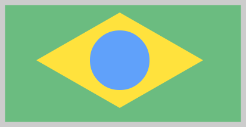

# Canvas.drawPoly

Canvas.drawPoly
-

# Canvas.drawPoly

## Синтаксис

drawPoly(pointArr: Array, drawFill: Boolean, drawStroke:
 Boolean);

## Параметры

pointsArr. Массив точек в виде
 экземпляров класса PP.[Point](dhtmlCommon.chm::/Classes/PP/Point/Point.htm)
 или объекта содержащего поля x
 и y;

drawFill. Определяет, будет
 ли залита полилиния. Если для параметра установлено значение true,
 то полилиния будет залита;

drawStroke. Определяет, будут
 ли отрисованы границы полилинии. Если для параметра установлено значение
 true, то границы будут отрисованы.

## Описание

Метод drawPoly рисует полилинию
 на канве.

## Комментарии

Полилиния будет отображена на канве после вызова метода [Canvas.flush](Canvas.flush.htm).

Полилиния - это непрерывная линия, сформированная из одной или более
 соединённых линий.

## Пример

Для выполнения примера предполагается наличие на странице компонента
 [Canvas](../../Components/Canvas/Canvas.htm) c наименованием
 «canvas» (см. «[Пример
 создания компонента Canvas](../../Components/Canvas/Example_Canvas.htm)»). Отрисуем на канве окружность с заливкой
 и поллинию с заливкой:

// Устанавливам стиль заливки фигур
canvas.setFillStyle("#FFE23D");
// Включаем отрисовку полилинии
canvas.beginPath(true, false);
canvas.drawPoly([
    {
        x: 60,
        y: 100
    },
    {
        x: 200,
        y: 20
    },
    {
        x: 340,
        y: 100
    },
    {
        x: 200,
        y: 180
    },
    {
        x: 60,
        y: 100
    }
], true, false);
// Выключаем отрисовку полилинии
canvas.endPath(false);
// Устанавливам стиль заливки фигур
canvas.setFillStyle("#60A1FA");
// Рисуем окружность с заливкой, но без границ
canvas.drawCircle(200, 100, 50, true, false);
// Принимаем изменения канвы
canvas.flush();
В результате на канве будут отрисованы окружность и полилиния:

См. также:

[Canvas](Canvas.htm)

		Справочная
		 система на версию 10.9
		 от 18/08/2025,
		 © ООО «ФОРСАЙТ»,
