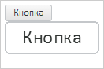
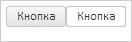

# Конструктор CanvasHTMLRenderer

Конструктор CanvasHTMLRenderer
-

# Конструктор CanvasHTMLRenderer

## Синтаксис

PP.Ui.CanvasHTMLRenderer(settings);

## Параметры

settings. JSON-объект со значениями
 свойств компонента.

## Описание

Конструктор CanvasHTMLRenderer
 создает экземпляр класса [CanvasHTMLRenderer](CanvasHTMLRenderer.htm).

## Пример

Для выполнения примера необходимо наличие на html-странице ссылок на
 файлы сценариев PP.js, PP.Util.js и файл стилей PP.css. В событие onload
 тега <body> необходимо добавить вызов функции createHTMLRenderer().
 Создаем кнопку и класс рисования DOM-дерева, получаем графическое представление
 DOM-вершины кнопки:

function createHTMLRenderer() {
    // Создаем кнопку
    var button = new PP.Ui.Button({
        // Устанавливаем родительский элемент
        ParentNode: document.getElementById("button"),
        // Устанавливаем содержимое кнопки
        Content: "Кнопка",
        // Устанавливаем ширину кнопки
        Width: 60
    });
    // Создаем класс для рисования DOM-дерева
    var canvas = new PP.Ui.CanvasHTMLRenderer({
        // Устанавливаем загрузчик изображений
        ImagePreloader: new PP.Ui.ImagePreloader(),
        // Отключение авторасчета размера и позиции области отрисовки
        RecursiveBoundsCalc: false,
        // Отключаем запуск проверочного теста
        TaintTest: false,
        // Координата Y левого верхнего угла области
        Top: 14,
        // Координата X левого верхнего угла области
        Left: 19,
        // Ширина области
        Width: 60,
        // Высота области
        Height: 25,
        // Масштаб по оси X
        ScaleX: 2,
        // масштаб по оси Y
        ScaleY: 2,
        // Устанавливаем обработчик события, которое вызывается после завершения рисования
        Rendered: function (sender, args) {
            // После завершения рисования добавляем изображение на страницу
            button.getDomNode().insertAdjacentElement("afterEnd", args.Canvas);
            console.log("Завершено рисование");
        },
        // Устанавливаем обработчик события, которое вызывается после загрузки изображений
        Preloaded: function (sender, args) {
            console.log("Завершена загрузка изображений");
        },
    });
    // Отрисовываем DOM-дерево
    canvas.render(button.getDomNode());
}
В результате будет отрисована кнопка в 2 раза больше обычной:

В консоль будет выведено сообщение о загрузке изображений и завершении
 рисования:

Завершена загрузка изображений

Завершено рисование

Уменьшаем масштаб до единицы и перерисовываем изображение:

// Уменьшаем масштаб
canvas.setScale(1);
// Отрисовываем DOM-дерево
canvas.render(button.getDomNode());
В результате будет нарисована кнопка в натуральную величину:

См. также:

[CanvasHTMLRenderer](CanvasHTMLRenderer.htm)

		Справочная
		 система на версию 10.9
		 от 18/08/2025,
		 © ООО «ФОРСАЙТ»,
