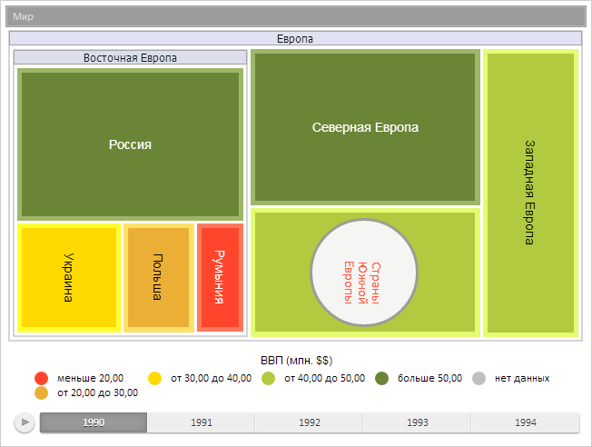
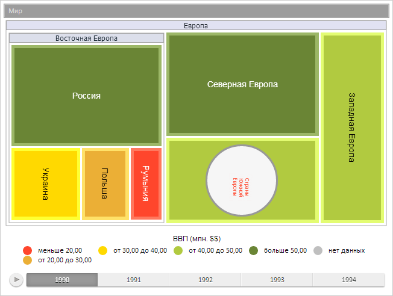

# Конструктор CanvasLabel

Конструктор CanvasLabel
-

# Конструктор CanvasLabel

## Синтаксис

PP.Ui.CanvasLabel(settings: Object);

## Параметры

settings. JSON-объект со значениями
 свойств подписи на канве.

## Описание

Конструктор CanvasLabel создаёт
 объект подписи на канве.

## Пример

Для выполнения примера предполагается наличие на странице компонента
 [TreeMap](dhtmlBubbleTree.chm::/Components/TreeMap/TreeMap.htm)
 с наименованием «treeMap» (см. «[Пример
 создания компонента TreeMap](dhtmlBubbleTree.chm::/Components/TreeMap/TreeMap_example.htm)» ). Создадим на канве плоского дерева
 подпись «Страны Южной Европы»):

// Получаем настройки канвы плоского дерева
var canvasContext = treeMap.getCanvasContext();
// Создадим метку на канве
var canvasLabel = new PP.Ui.CanvasLabel({
    AutoOrientation: false, // Автоориентация подписи запрещена
    CanvasContext: canvasContext, // Контекст рисования канвы
    Circular: true, // Подпись отображаем в виде круга
    Padding: [25, 0, 0, 0], // Внутренние отступы подписи
    Position: {
        Height: 120,
        Left: 290,
        Top: 210,
        Width: 210
    }, // Расположение подписи
    Style: { // Стиль подписи
        Release: {
            Border: {
                PPType: "PP.Border",
                Width: 3 // Толщина границы подписи
            }
        }
    },
    TextWrapping: PP.Ui.TextWrapping.Wrap, // Перенос текста по словам
    Values: {
        Name: "Страны Южной Европы" // Текст подписи
    },
    Vertical: true // Вертикальное расположение подписи
});
// Определяем цвет заливки подписи
var brush = new PP.SolidColorBrush({
    Color: "#ffffff"
});
// Устанавливаем цвет заливки подписи
canvasLabel.setBackground(brush);
// Устанавливаем прозрачность заливки
canvasLabel.setOpacity(0.9);
// Устанавливаем цвет шрифта подписи
canvasLabel.setFontColor("#ff462c");
// Определяем и устанавливаем цвет границы подписи
var borderColor = new PP.Color("#999999");
canvasLabel.setBorderColor(borderColor);
// Обновляем текст подписи
canvasLabel.updateContent();
// Отрисовываем подпись на канве
canvasLabel.draw(true, true);
console.log("Смещение всплывающей подсказки относительно канвы равно %s", canvasLabel.getTooltipOffset());
В результате выполнения примера на канве плоского дерева была нарисована
 подпись с текстом «Страны Южной Европы». Данная подпись имеет вертикальное
 направление, заливку белого цвета с прозрачностью 90%, границу серого
 цвета с толщиной, равной 2 пикселям, и внутренний левый отступ, равный
 25 пикселям:

Текст подписи имеет красный цвет и переносится по словам. Теперь установим
 новое значение максимального допустимого размера шрифта:

// Устанавливаем максимальный размер шрифта
canvasLabel.setMaxSize(12);
// Перерисовываем подпись на канве
canvasLabel.draw();
После выполнения примера размер шрифта уменьшится в соответствии с новым
 максимальным допустимым значением:

[CanvasLabel](CanvasLabel.htm)

		Справочная
		 система на версию 10.9
		 от 18/08/2025,
		 © ООО «ФОРСАЙТ»,
