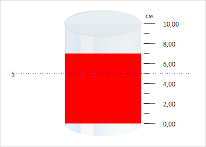

# Cylinder.IsFlat

Cylinder.IsFlat
-

# Cylinder.IsFlat

## Синтаксис

IsFlat: Boolean;

## Описание

Свойство IsFlat определяет признак
 объёмности цилиндра.

## Комментарии

Значение свойства устанавливается из JSON и с помощью метода setIsFlat,
 а возвращается с помощью метода getIsFlat.

Допустимые значения:

	- true.
	 Плоский цилиндр;

	- false.
	 Объёмный цилиндр (по умолчанию).

## Пример

Для выполнения примера необходимо наличие на html-странице компонента
 [Cylinder](../../../Components/Cylinder/Cylinder.htm) с наименованием
 «cylinder» (см. «[Пример
 создания компонента Cylinder](../../../Components/Cylinder/Cylinder_Example.htm)»). Отключим анимацию и отобразим плоский
 цилиндр:

// Отключаем анимацию
cylinder.setUseAnimation(false);
// Отображаем плоский цилиндр
cylinder.setIsFlat(true);
В результате выполнения примера был отображён плоский цилиндр:

См. также:

[Cylinder](Cylinder.htm)

		Справочная
		 система на версию 10.9
		 от 18/08/2025,
		 © ООО «ФОРСАЙТ»,
