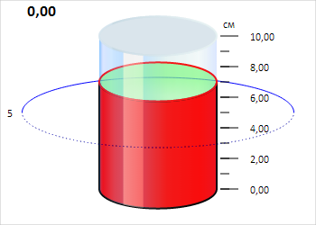

# Cylinder.Values

Cylinder.Values
-

# Cylinder.Values

## Синтаксис

Values: Array;

## Описание

Свойство Values определяет массив
 значений цилиндра.

## Комментарии

Значение свойства устанавливается из JSON и с помощью метода setValues,
 а возвращается с помощью метода getValues.

Метод getValues содержит необязательный
 параметр index, устанавливающий
 индекс значения цилиндра в массиве. Если индекс задан, метод getValues
 возвращает элемент массива по указанному индексу, в противном случае
 метод возвращает весь массив значений цилиндра.

Свойство содержит массив объектов типа [CylinderGaugeValue](../CylinderGaugeValue/CylinderGaugeValue.htm).

## Пример

Для выполнения примера необходимо наличие на html-странице компонента
 [Cylinder](../../../Components/Cylinder/Cylinder.htm) с наименованием
 «cylinder» (см. «[Пример
 создания компонента Cylinder](../../../Components/Cylinder/Cylinder_Example.htm)»). Получим значение цилиндра и применим
 для него новый стиль:

var applyGaugeValueStyle = function(value) {
    // Устанавливаем прозрачность основания
    value.getUp().setAttribute("fill-opacity", 0.5);
    // Устанавливаем цвет границы основания цилиндра
    value.getUpGlare().setAttribute("stroke", value.getFill().getColor());
    // Устанавливаем цвет границы для боковой поверхности цилиндра
    value.getColumn().setAttribute("stroke", PP.Color.Colors.black);
    // Устанавливаем толщину границ цилиндра
    value.getEventNode().setAttribute("stroke-width", "2");
}
// Применяем стиль для значения цилиндра
applyGaugeValueStyle(cylinder.getValues()[0]);
В результате выполнения примера был изменён стиль основания цилиндра
 и толщина его границ:

См. также:

[Cylinder](Cylinder.htm)

		Справочная
		 система на версию 10.9
		 от 18/08/2025,
		 © ООО «ФОРСАЙТ»,
