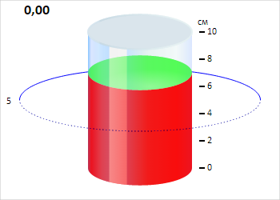

# CylinderGaugeAxis.Labels

CylinderGaugeAxis.Labels
-

# CylinderGaugeAxis.Labels

## Синтаксис

Labels: Array;

## Описание

Свойство Labels определяет подписи
 для основных делений оси цилиндра.

## Комментарии

Значение свойства устанавливается с помощью JSON, а возвращается с помощью
 метода getLabels.

## Пример

Для выполнения примера необходимо заменить на странице «[Пример
 создания компонента Cylinder](../../../Components/Cylinder/Cylinder_Example.htm)» тело метода createGaugeAxis
 на сценарий, создающий ось цилиндра с новыми настройками:

// Создаём ось цилиндра
var createGaugeAxis = function() {
    var axis = new PP.Ui.CylinderGaugeAxis({
        ParentCylinder: cylinder, // Родительский цилиндр
        MajorTicksCount: 6, // Количество основных делений оси
        Width: 450, // Ширина оси
        Height: 250, // Высота оси
        Min: 0, // Минимальное значение оси
        Max: 10, // Максимальное значение оси
        LabelStyle: new PP.Style(), // Стиль для делений оси
        Labels: this.getAxisValues(0, 10, 6),
        LabelsMode: PP.Ui.AxisLabelsMode.Custom,
        ValuesMode: PP.Ui.AxisValuesMode.MinMax, // Режим отображения значений оси
        Position: PP.LTRB.Right, // Располагаем ось справа
    });
    cylinder.draw();
    // Устанавливаем ось
    cylinder.setAxis(axis.getSettings());
    // Обновляем стиль для оси цилиндра
    this.applyStyleForAxis(axis);
    // Обновляем ось цилиндра
    this.updateAxis(axis);
    axis.redraw();
}
В результате выполнения примера была создана ось цилиндра с новыми подписями
 и без промежуточных делений:

См. также:

[CylinderGaugeAxis](CylinderGaugeAxis.htm)

		Справочная
		 система на версию 10.9
		 от 18/08/2025,
		 © ООО «ФОРСАЙТ»,
