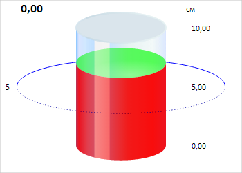

# CylinderGaugeAxis.Values

CylinderGaugeAxis.Values
-

# CylinderGaugeAxis.Values

## Синтаксис

Values: Array;

## Описание

Свойство Values определяет массив
 значений оси цилиндра.

## Комментарии

Значение свойства устанавливается из JSON и с помощью метода setValues,
 а возвращается с помощью метода getValues.

## Пример

Для выполнения примера необходимо наличие на html-странице компонента
 [Cylinder](../../../Components/Cylinder/Cylinder.htm) с наименованием
 «cylinder» (см. «[Пример
 создания компонента Cylinder](../../../Components/Cylinder/Cylinder_Example.htm)»). Скроем деления и установим новые подписи
 для оси цилиндра:

// Получаем ось цилиндра
var axis = cylinder.getAxis();
// Скрываем деления цилиндра
axis.setShowMajorTicks(false);
axis.setShowMinorTicks(false);
// Устанавливаем значения для оси
axis.setValues([0, 5, 10]);
// Получаем подписи для делений оси
var calcLabels = axis.autoCalcLabels();
console.log("Подписи для делений оси: %s", calcLabels.toString());
В результате выполнения примера были скрыты деления, и установлены новые
 подписи для оси цилиндра:

В консоли браузера были выведены подписи для делений оси:

Подписи для делений оси: 0,00,5,00,10,00

См. также:

[CylinderGaugeAxis](CylinderGaugeAxis.htm)

		Справочная
		 система на версию 10.9
		 от 18/08/2025,
		 © ООО «ФОРСАЙТ»,
