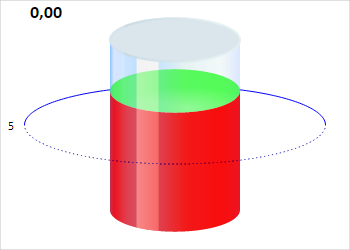

# CylinderGaugeAxis.clear

CylinderGaugeAxis.clear
-

# CylinderGaugeAxis.clear

## Синтаксис

clear();

## Описание

Метод clear очищает ось цилиндра.

## Пример

Для выполнения примера необходимо наличие на html-странице компонента
 [Cylinder](../../../Components/Cylinder/Cylinder.htm) с наименованием
 «cylinder» (см. «[Пример
 создания компонента Cylinder](../../../Components/Cylinder/Cylinder_Example.htm)»). Очистим ось цилиндра:

cylinder.getAxis().clear();
В результате выполнения примера ось цилиндра была очищена:

См. также:

[CylinderGaugeAxis](CylinderGaugeAxis.htm)

		Справочная
		 система на версию 10.9
		 от 18/08/2025,
		 © ООО «ФОРСАЙТ»,
