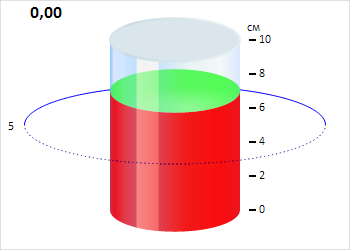

# CylinderGaugeAxis.getValuePoint

CylinderGaugeAxis.getValuePoint
-

# CylinderGaugeAxis.getValuePoint

## Синтаксис

getValuePoint(value: Number);

## Описание

Метод getValuePoint возвращает
 точку, в которой расположено значение оси цилиндра.

## Пример

Для выполнения примера необходимо наличие на html-странице компонента
 [Cylinder](../../../Components/Cylinder/Cylinder.htm) с наименованием
 «cylinder» (см. «[Пример
 создания компонента Cylinder](../../../Components/Cylinder/Cylinder_Example.htm)»). Изменим внешний вид оси цилиндра:

// Определяем значения оси
var values = ["0", "2", "4", "6", "8", "10"];
// Получаем ось цилиндра
var axis = cylinder.getAxis();
// Добавляем подписи для делений оси
for (var i in values) {
    var label = new PP.Ui.ChartSVGLabel({
        ParentNode: axis.getDomNode(), // Родительская DOM-вершина
        Text: values[i], // Текст подписи
        Left: axis.getValuePoint(values[i]).getX() + 15, // Отступ от левой границы
        Top: axis.getValuePoint(values[i]).getY() - 9 // Отступ от верхней границы
    });
    // Отрисовываем подпись
    label.draw();
}
// Удаляем старые подписи оси
for (var i in axis.getLabelset()) {
    var label = axis.getLabelset()[i];
    label.dispose();
}
// Удаляем основные деления оси
for (var i in axis.getMajorTicks()) {
    var tick = axis.getMajorTicks()[i];
    tick.clear();
    tick = new PP.Ui.AxisTick({
        ParentAxis: axis
    });
    tick.setPosition(new PP.Point({
        X: axis.getValuePoint(values[i]).getX() + 5,
        Y: axis.getValuePoint(values[i]).getY()
        })
    );
    tick.setTickStyle({
        Border: new PP.Border({
            Width: 2, // Толщина отделений
        }),
        Length: 7
    });
    tick.redraw();
}
// Удаляем промежуточные деления оси
for (var i in axis.getMinorTicks()) {
    var tick = axis.getMinorTicks()[i];
    tick.clear();
}
В результате выполнения примера был изменён внешний вид оси цилиндра:

См. также:

[CylinderGaugeAxis](CylinderGaugeAxis.htm)

		Справочная
		 система на версию 10.9
		 от 18/08/2025,
		 © ООО «ФОРСАЙТ»,
