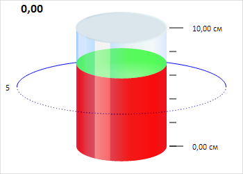

# CylinderGaugeAxis.setValuesByMinAndMax

CylinderGaugeAxis.setValuesByMinAndMax
-

# CylinderGaugeAxis.setValuesByMinAndMax

## Синтаксис

setValuesByMinAndMax(min: Number, max: Number, majorTicksCount:
 Number);

## Параметры

min. Минимальное значение оси
 цилиндра;

max. Максимальное значение
 оси цилиндра;

majorTicksCount. Количество
 основных делений оси цилиндра.

## Описание

Метод setValuesByMinAndMax устанавливает
 количество основных делений, а также минимальное и максимальное значения
 оси цилиндра.

## Пример

Для выполнения примера необходимо наличие на html-странице компонента
 [Cylinder](../../../Components/Cylinder/Cylinder.htm) с наименованием
 «cylinder» (см. «[Пример
 создания компонента Cylinder](../../../Components/Cylinder/Cylinder_Example.htm)»). Обновим стиль оси цилиндра:

// Получаем ось цилиндра
var axis = cylinder.getAxis();
axis.setValuesByMinAndMax(0, 10, 2);
// Устанавливаем шаг между промежуточными делениями оси
axis.setMinorTicksStep(2);
// Отображаем подпись с единицей измерения для каждого значения
axis.setShowUnitsForEachValue(true);
axis.getUnit().dispose();
// Обновляем стиль оси цилиндра
this.applyStyleForAxis(axis);
В результате выполнения примера установлен новый шаг между промежуточными
 делениями оси, и установлены подписи с указанием единицы измерения:

См. также:

[CylinderGaugeAxis](CylinderGaugeAxis.htm)

		Справочная
		 система на версию 10.9
		 от 18/08/2025,
		 © ООО «ФОРСАЙТ»,
