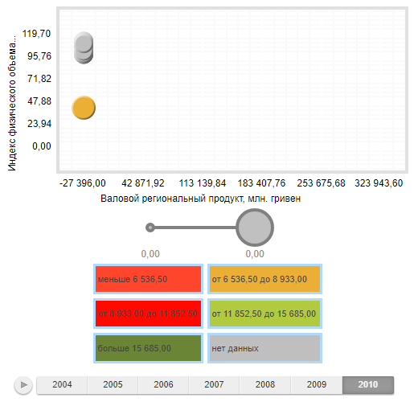

# IntervalsLegend.CellBorder

IntervalsLegend.CellBorder
-

# IntervalsLegend.CellBorder

## Синтаксис

CellBorder: Object || [PP.Border](dhtmlCommon.chm::/Classes/PP/border/border.htm);

## Описание

Свойство CellBorder определяет
 рамку элементов легенды.

## Комментарии

Значение свойства устанавливается из JSON и с помощью метода setCellBorder,
 а возвращается с помощью метода getCellBorder.

## Пример

Для выполнения примера необходимо наличие на html-странице компонента
 [BubbleChart](dhtmlBubbleChart.chm::/Components/BubbleChart/BubbleChart.htm) с
 наименованием «bubbleChart» (см. «[Пример
 создания компонента BubbleChart](dhtmlBubbleChart.chm::/Components/BubbleChart/BubbleChart_Example.htm)»).

// Получим легенду интервалов
var legend = bubbleChart.getLegend();
// Установим цвет шрифта легенды на основе цвета заливки
legend.setCellAutoColor(false);
// Отключим автоматический расчет количества столбцов
legend.setAutoColumnsCount(false);
// Отобразим легенду в два столбца
legend.setColumnsCount(2);
// Зададим и установим рамку для элементов легенды
var border = new PP.Border({
    "Color": '#afdafc',
    "Width": 3,
    "Style": 'solid'
});
legend.setCellBorder(border);
// Зададим и установим поля для элементов легенды
var thickness = new PP.Thickness({
    Top: 10,
    Bottom: 10,
    Left: 3,
    Right: 3,
    Width: 10
});
legend.setCellPadding(thickness);
// Установим режим цветовой визуализации интервальной легенды
legend.setColorApplying(PP.Ui.IntervalsLegendColorApplying.Background);
// Обновим диаграмму
bubbleChart.refresh();
В результате выполнения примера вид легенды изменится в соответствии
 с заданными параметрами:

См. также:

[IntervalsLegend](IntervalsLegend.htm)

		Справочная
		 система на версию 10.9
		 от 18/08/2025,
		 © ООО «ФОРСАЙТ»,
