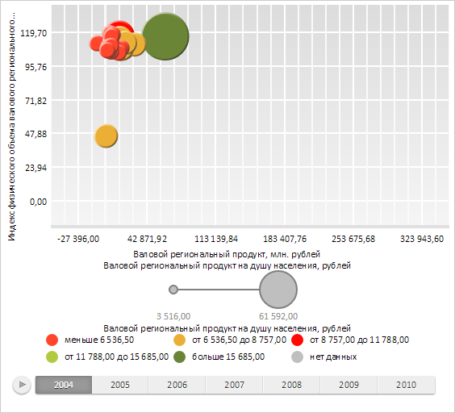

# IntervalsLegend.ItemsOrder

IntervalsLegend.ItemsOrder
-

# IntervalsLegend.ItemsOrder

## Синтаксис

ItemsOrder: [PP.Ui.LegendItemsOrder](../../Enums/LegendItemsOrder.htm);

## Описание

Свойство ItemsOrder определяет
 порядок отображения элементов в легенде.

## Комментарии

Значение свойства устанавливается с помощью метода setItemsOrder,
 а возвращается с помощью метода getItemsOrder.

По умолчанию значение свойства равно [PP.Ui.LegendItemsOrder.TopToBottomByPages](../../Enums/LegendItemsOrder.htm).

## Пример

Для выполнения примера необходимо наличие на html-странице компонента
 [BubbleChart](dhtmlBubbleChart.chm::/Components/BubbleChart/BubbleChart.htm)
 с наименованием «bubbleChart» (см. «[Пример
 создания компонента BubbleChart](dhtmlBubbleChart.chm::/Components/BubbleChart/BubbleChart_Example.htm)»). Установим порядок
 отображения элементов в легенде:

// Получаем легенду матрицы
var legend = bubbleChart.getLegend();
// Устанавливаем порядок отображения элементов в легенде
legend.setItemsOrder(PP.Ui.LegendItemsOrder.LeftToRight);
// Обновляем отображение матрицы
bubbleChart.refresh();
В результате выполнения примера элементы легенды были отображены слева
 направо:

См. также:

[IntervalsLegend](IntervalsLegend.htm)

		Справочная
		 система на версию 10.9
		 от 18/08/2025,
		 © ООО «ФОРСАЙТ»,
