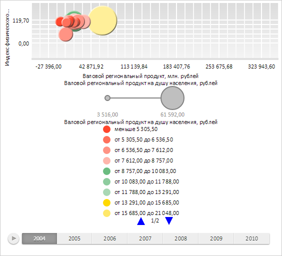
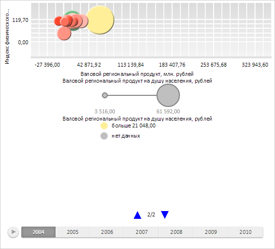

# IntervalsLegend.PageMode

IntervalsLegend.PageMode
-

# IntervalsLegend.PageMode

## Синтаксис

PageMode: [PP.Ui.LegendPageMode](../../Enums/LegendPageMode.htm);

## Описание

Свойство PageMode определяет
 режим разбиения элементов легенды на страницы.

## Комментарии

Значение свойства устанавливается с помощью метода setPageMode,
 а возвращается с помощью метода getPageMode.

По умолчанию значение свойства равно [PP.Ui.LegendPageMode.SinglePage](../../Enums/LegendPageMode.htm).

## Пример

Для выполнения примера необходимо наличие на html-странице компонента
 [BubbleChart](dhtmlBubbleChart.chm::/Components/BubbleChart/BubbleChart.htm)
 с наименованием «bubbleChart» (см. «[Пример
 создания компонента BubbleChart](dhtmlBubbleChart.chm::/Components/BubbleChart/BubbleChart_Example.htm)»). Создадим новую цветовую
 шкалу пузырьковой диаграммы и установим режим разбиения легенды на страницы:

// Создаем массив со значениями цветовой шкалы матрицы
var palette = [
    "RGB(255,70,44)", "RGB(255,112,91)", "RGB(255,147,132)", "RGB(255,182,172)", "RGB(107,188,128)",
    "RGB(142,204,158)", "RGB(169,216,181)", "RGB(255,217,0)", "RGB(255,232,106)", "RGB(255,239,153)"
];
// Применяем цветовую шкалу матрицы
bubbleChart.applyColorScheme(palette);
// Получаем легенду пузырьковой диаграммы
var legend = bubbleChart.getLegend();
// Запрещаем автоматический расчет количества столбцов легенды
legend.setAutoColumnsCount(false);
// Устанавливаем количество столбцов легенды
legend.setColumnsCount(1);
// Устанавливаем режим разбиения легенды на страницы
legend.setPageMode(PP.Ui.LegendPageMode.MultiplePages);
// Обновляем пузырьковую диаграмму
bubbleChart.refresh();
В результате выполнения примера для легенды матрицы был установлен режим
 разбиения элементов на несколько страниц:

Далее осуществим переход к новой странице легенды:

// Проверяем количество страниц в легенде
if (legend.getPagesCount() > 1) {
    // Устанавливаем новую текущую страницу
    legend.setCurrentPage(1);
}
В результате на экране была отображена вторая страница легенды матрицы:

См. также:

[IntervalsLegend](IntervalsLegend.htm)

		Справочная
		 система на версию 10.9
		 от 18/08/2025,
		 © ООО «ФОРСАЙТ»,
