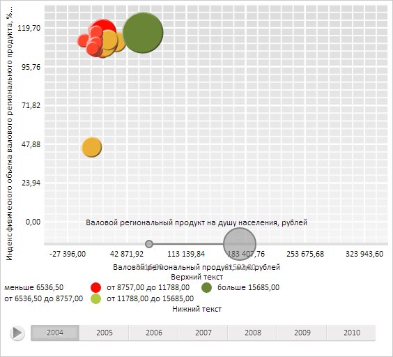

# LegendBase.ContentAlignment

LegendBase.ContentAlignment
-

**

# LegendBase.ContentAlignment

## Синтаксис

ContentAlignment: [PP.HorizontalAlignment](dhtmlCommon.chm::/Enums/PP.HorizontalAlignment.htm);

## Описание

Свойство ContentAlignment определяет
 выравнивание содержимого легенды.

## Комментарии

Значение свойства устанавливается из JSON и с помощью метода setContentAlignment,
 а возвращается с помощью метода getContentAlignment.**

## Пример

Для выполнения примера необходимо наличие на html-странице компонента
 [BubbleChart](dhtmlBubbleChart.chm::/Components/BubbleChart/BubbleChart.htm)
 с наименованием «bubbleChart» (см. «[Пример
 создания компонента BubbleChart](dhtmlBubbleChart.chm::/Components/BubbleChart/BubbleChart_Example.htm)»). Изменим выравнивание содержимого
 легенды, установим верхний и нижний текст легенды, скроем отметку отсутствия
 данных, установим перекрытие легендой размеров основной области пузырьковой диаграммы,
 выведем тип легенды, обработаем событие [HeaderClicked](LegendBase.HeaderClicked.htm):

// Получим легенду интервалов значений
var legend = bubbleChart.getLegends()[0];
// Установим ширину легенды
legend.setWidth(600);
// Установим выравнивание контента легенды
legend.setContentAlignment(PP.HorizontalAlignment.Left);
// Изменим верхний текст легенды
var header = legend.getHeader();
header.setText("Верхний текст");
legend.setHeader(header);
// Установим нижний текст легенды
legend.setFooter(new PP.Ui.LegendHeader({
    Text: "Нижний текст",
    VerticalAlignment: PP.VerticalAlignment.Bottom
}));
// Скроем отметку отсутствия данных
legend.setNoDataVisible(false);
// Установим перекрытие легендой размеров основной области пузырьковой диаграммы
bubbleChart.getLegends()[1].setIsOverlap(true);
// Обновим пузырьковую диаграмму
bubbleChart.refresh();
// Выведем тип легенды
console.log("Тип легенды: " + legend.getType());
// Обработаем событие HeaderClicked
legend.HeaderClicked.add(function () {
    // Выведем сообщение о щелчке по верхнему тексту легенды
    console.log("Инициировано событие HeaderClicked")
});
Щёлкнем по верхнему тексту легенды интервалов.

В результате выполнения примера было изменено выравнивание содержимого
 легенды интервалов, был установлен верхний и нижний текст, была скрыта
 метка отсутствия данных и установлено перекрытие легендой размеров основной
 области пузырьковой диаграммы:

Также в консоли браузера был выведен тип легенды и сообщение о вызове
 обработанного события:

Тип легенды: Intervals

Инициировано событие HeaderClicked

См. также:

[LegendBase](LegendBase.htm)

		Справочная
		 система на версию 10.9
		 от 18/08/2025,
		 © ООО «ФОРСАЙТ»,
