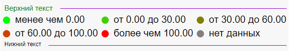

# LegendBase.FooterLine

LegendBase.FooterLine
-

**

# LegendBase.FooterLine

## Синтаксис

FooterLine: [PP.Ui.LineLabel](dhtmlUi.chm::/Classes/LineLabel/LineLabel.htm);

## Описание

Свойство FooterLine определяет
 линию рядом с нижним текстом легенды.

## Комментарии

Значение свойства устанавливается из JSON.**

## Пример

Для выполнения примера создайте html-страницу и выполните следующие
 действия:

1. В теге <head> добавьте ссылки на следующие js- и css-файлы:

	- PP.js;

	- PP.GraphicsBase.js

	- PP.css.

2. В теге <body> задайте настройки контейнера, где будет расположена
 легенда:

<body onresize="onresize()">
    

    

</body>
3. В теге 
В результате выполнения примера на html-странице будет отображена легенда
 с заданными параметрами:

См. также:

[LegendBase](LegendBase.htm)

		Справочная
		 система на версию 10.9
		 от 18/08/2025,
		 © ООО «ФОРСАЙТ»,
