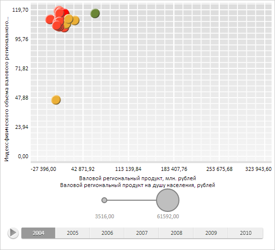

# LegendBase.Visibility

LegendBase.Visibility
-

**

# LegendBase.Visibility

## Синтаксис

Visibility: [PP.Ui.Visibility](dhtmlMapChart.chm::/Enums/Visibility.htm);

## Описание

Свойство Visibility определяет
 видимость легенды.

## Комментарии

Значение свойства устанавливается из JSON и с помощью метода setVisibility,
 а возвращается с помощью метода getVisibility.**

## Пример

Для выполнения примера необходимо наличие на html-странице компонента
 [BubbleChart](dhtmlBubbleChart.chm::/Components/BubbleChart/BubbleChart.htm)
 с наименованием «bubbleChart» (см. «[Пример
 создания компонента BubbleChart](dhtmlBubbleChart.chm::/Components/BubbleChart/BubbleChart_Example.htm)»). Получим и скроем легенду интервалов:

// Получим легенду интервалов
var legend = bubbleChart.getLegends()[0];
// Скроем легенду
legend.setVisibility(PP.Ui.Visibility.Collapsed);
// Обновим диаграмму
bubbleChart.refresh();
В результате выполнения примера легенда интервалов была скрыта:

См. также:

[LegendBase](LegendBase.htm)

		Справочная
		 система на версию 10.9
		 от 18/08/2025,
		 © ООО «ФОРСАЙТ»,
