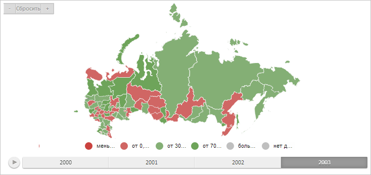

# MiniMap.Control

MiniMap.Control
-

# MiniMap.Control

## Синтаксис

Control: PP.Ui.IMiniMappable

## Описание

Свойство Control содержит управляющий
 элемент, к которому привязана панель управления масштабом.

## Комментарии

Значение свойства устанавливается из JSON и с помощью метода setControl,
 а возвращается с помощью метода getControl.

## Пример

Для выполнения примера предполагается наличие на странице компонента
 [MapChart](dhtmlMapChart.chm::/Components/MapChart/MapChart.htm)
 c наименованием «map» (см. «[Пример
 создания компонента MapChart](dhtmlMapChart.chm::/Components/MapChart/MapChart_Example.htm)»). Пример нужно разместить
 в теге <script>. Создаем панель управления масштабом и добавляем
 ее к карте:

var miniMap = new PP.Ui.MiniMap({
    // Устанавливаем ширину панели масштабирования
    Width: 100,
    // Устанавливаем признак отображения карты
    ShowMap: true,
    // Устанавливаем признак отображения кнопок управления масштабом
    ShowButtons: true,
    // Устанавливаем признак изменения пропорций карты при изменении размера
    KeepProportions: false,
    // Устанавливаем признак сохранения начальных границ
    KeepInitialBounds: true,
    // Устанавливаем высоту кнопок управления масштабом
    ButtonsHeight: 20,
    FrameStyle: new PP.Style({ Background: new PP.SolidColorBrush({ Color: PP.Color.Colors.lightgreen })})
});
// Добавляем панель масштабирования на карту
map.setMiniMap(miniMap);
// Устанавливаем панели масштабирования управляющий элемент
miniMap._Control = map;
// Отображаем панель масштабирования на карте
map.setMiniMapEnabled(true, false);
// Убираем значки погоды
map._MilestoneLayer.remove();
В результате на карту будет добавлена панель масштабирования:

См. также:

[MiniMap](MiniMap.htm)

		Справочная
		 система на версию 10.9
		 от 18/08/2025,
		 © ООО «ФОРСАЙТ»,
