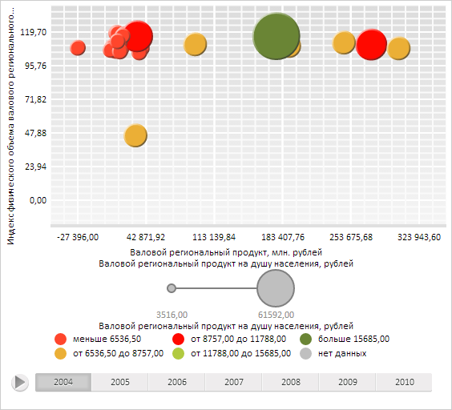

# DataMapping.Index

DataMapping.Index
-

# DataMapping.Index

## Синтаксис

Index: Integer;

## Описание

Свойство Index определяет индекс, по которому необходимо получать данные из каждого измерения.

## Комментарии

Значение свойства устанавливается из JSON и с помощью свойства setFormat.

## Пример

Для выполнения примера необходимо наличие на html-странице компонента [BubbleChart](dhtmlBubbleChart.chm::/Components/BubbleChart/BubbleChart.htm) с наименованием «bubbleChart» (см. «[Пример создания компонента BubbleChart](dhtmlBubbleChart.chm::/Components/BubbleChart/BubbleChart_Example.htm)»). Отобразим в пузырьковой диаграмме данные, соответствующие индексу 5 относительно оси X:

// Получим настройки сопоставления данных рядов оси X пузырьковой диаграммы
var xVisual = bubbleChart.getXVisual();
// Получим настройки сопоставления данных
var mapping = xVisual.getCoordinateMapping();
// Установим новый индекс
mapping.setIndex(5);
// Отобразим данные, соответствующие индексу 5
bubbleChart.animate(bubbleChart.getTimeline().getStepDuration());

В результате выполнения примера в пузырьковой диаграмме были отображены данные, соответствующие индексу 5 относительно оси X:

См. также:

[DataMapping](DataMapping.htm)

		Справочная
		 система на версию 10.9
		 от 18/08/2025,
		 © ООО «ФОРСАЙТ»,
