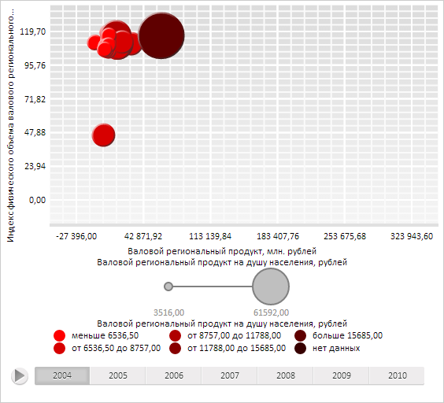

# DataMapping.Scale

DataMapping.Scale
-

# DataMapping.Scale

## Синтаксис

Scale: PP.ScaleBase;

## Описание

Свойство Scale определяет шкалу сопоставления данных в источнике.

## Комментарии

Значение свойства устанавливается из JSON и с помощью свойства setScale.

## Пример

Для выполнения примера необходимо наличие на html-странице компонента [BubbleChart](dhtmlBubbleChart.chm::/Components/BubbleChart/BubbleChart.htm) с наименованием «bubbleChart» (см. «[Пример создания компонента BubbleChart](dhtmlBubbleChart.chm::/Components/BubbleChart/BubbleChart_Example.htm)»). Установим для пузырьков дерева красный цвет заливки разной насыщенности:

// Получим объект сопоставления данных рядов цветам пузырьков матрицы
var colorVisual = bubbleChart.getColorVisual();
// Получим настройки сопоставления данных
var mapping = colorVisual.getColorMapping();
// Получим шкалу цветов
var scale = mapping.getScale();
// Выполним обход по всем элементам шкалы
for (var i in scale.getItems()) {
    // Получим элемент шкалы
    var item = scale.getItems()[i];
    // Создадим красный цвет
    var colorBrush = new PP.SolidColorBrush({
        Color: new PP.Color(255  -  40  *  i, 0, 0)
    });
    // Установим созданный цвет текущему элементу шкалы
    item.setColor(colorBrush.getColor());
};
// Установим обновлённую шкалу
mapping.setScale(scale);
// Обновим матрицу
bubbleChart.refresh();

В результате выполнения примера пузырьки рассматриваемого дерева были окрашены в красный цвет разной насыщенности:

См. также:

[DataMapping](DataMapping.htm)

		Справочная
		 система на версию 10.9
		 от 18/08/2025,
		 © ООО «ФОРСАЙТ»,
