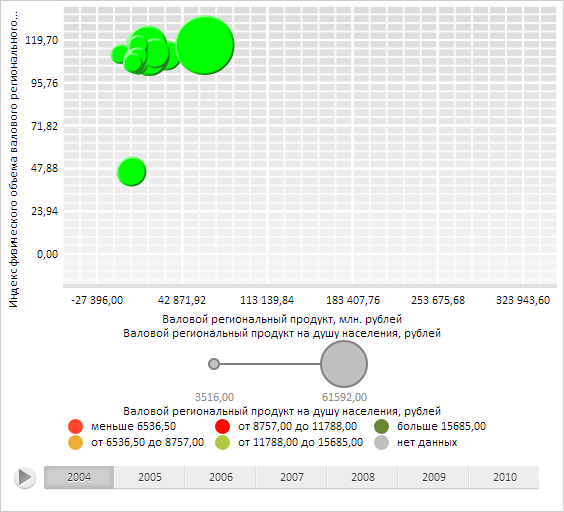

# DataMapping.Value

DataMapping.Value
-

# DataMapping.Value

## Синтаксис

Value: Number|String|Function;

## Описание

Свойство Value определяет значение, соответствующее всем элементам визуализатора.

## Комментарии

Значение свойства устанавливается из JSON и с помощью метода setValue.

Свойство Value используется, если значение свойства [Type](DataMapping.Type.htm) равно [PP.DataMappingType](../../../Enums/PP.DataMappingType.htm).Constant.

## Пример

Для выполнения примера необходимо наличие на html-странице компонента [BubbleChart](dhtmlBubbleChart.chm::/Components/BubbleChart/BubbleChart.htm) с наименованием «bubbleChart» (см. «[Пример создания компонента BubbleChart](dhtmlBubbleChart.chm::/Components/BubbleChart/BubbleChart_Example.htm)»). Окрасим все пузырьки пузырьковой диаграммы в зелёный цвет:

// Получим объект сопоставления данных рядов цветам пузырьков
var colorVisual = bubbleChart.getColorVisual();
// Получим настройки сопоставления данных
var mapping = colorVisual.getColorMapping();
// Установим константный тип сопоставления данных
mapping.setType(PP.DataMappingType.Constant);
// Создадим зелёный цвет заливки
var colorBrush = new PP.SolidColorBrush({
    Color: new PP.Color(0, 255, 0)
});
// Установим единый цвет заливки для всех пузырьков
mapping.setValue(colorBrush.getColor());
// Обновим пузырьковую диаграмму
bubbleChart.refresh();

В результате выполнения примера все пузырьки пузырьковой диаграммы были окрашены в зелёный цвет:

См. также:

[DataMapping](DataMapping.htm)

		Справочная
		 система на версию 10.9
		 от 18/08/2025,
		 © ООО «ФОРСАЙТ»,
