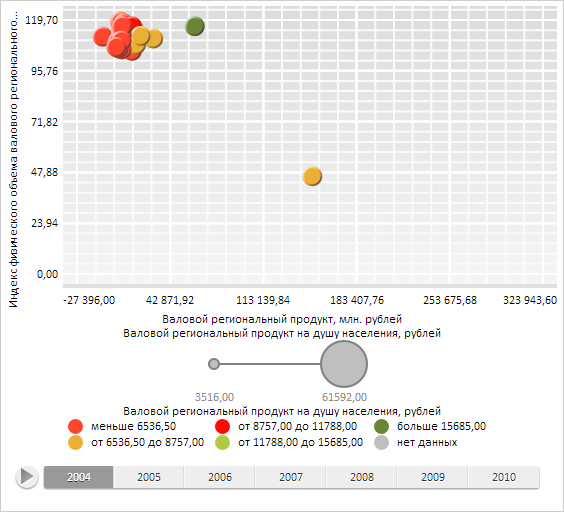

# DataSource.add

DataSource.add
-

# DataSource.add

## Синтаксис

add(id: String, timeAxis: [PP.TimeAxis](dhtmlCommon.chm::/Classes/PP/TimeAxis/TimeAxis.htm),
 dimAttrId: String);

## Параметры

id.
 Идентификатор ряда;

timeAxis.
 Временная ось, которую необходимо добавить;

dimAttrId.
 Идентификатор атрибута (если настроены атрибуты).

## Описание

Метод add добавляет данные для
 указанного атрибута ряда.

## Пример

Для выполнения примера необходимо наличие на html-странице компонента
 [BubbleChart](dhtmlBubbleChart.chm::/Components/BubbleChart/BubbleChart.htm)
 с наименованием «bubbleChart» (см. «[Пример
 создания компонента BubbleChart](dhtmlBubbleChart.chm::/Components/BubbleChart/BubbleChart_Example.htm)»). Получим источник данных и добавим
 в него новую временную ось:

// Получим источник данных
var dataSource = bubbleChart.getDataSources().ds0;
// Создадим и добавим новую временную ось
var tAxis = new PP.TimeAxis({
    Items: ["150000", "180000", "220000", "250000", "280000", "320000", "34000"]
});
dataSource.add("Serie0_Point0", tAxis, "DimX");
// Обновим диаграмму
bubbleChart.refresh();
В результате выполнения примера была создана и установлена новая временная
 ось:

См. также:

[DataSource](DataSource.htm)

		Справочная
		 система на версию 10.9
		 от 18/08/2025,
		 © ООО «ФОРСАЙТ»,
