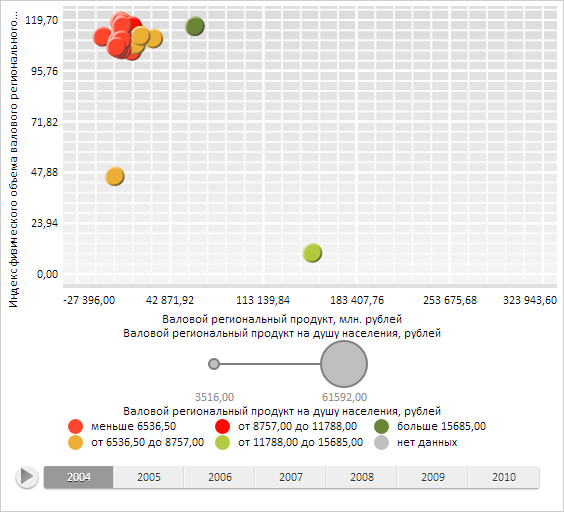

# DataSource.loadData

DataSource.loadData
-

# DataSource.loadData

## Синтаксис

loadData(data);

## Параметры

data. JSON-объект с данными, которые необходимо загрузить.

## Описание

Метод loadData осуществляет дополнительную загрузку данных в источник.

## Пример

Для выполнения примера необходимо наличие на html-странице компонента [BubbleChart](dhtmlBubbleChart.chm::/Components/BubbleChart/BubbleChart.htm) с наименованием «bubbleChart» (см. «[Пример создания компонента BubbleChart](dhtmlBubbleChart.chm::/Components/BubbleChart/BubbleChart_Example.htm)»). Определим и загрузим новые данные в источник для указанного ряда:

// Получим источник данных
var dataSource = bubbleChart.getDataSources().ds0;
// Определим новые данные
var newData = {
    "LoadedIndexes": [0, 1, 2, 3, 4, 5, 6],
    "Series": {
        "Serie1_Point0": {
            // Данные по оси X
            "DimX": {
                "Items": ["150000", "160000", "170000", "180000", "190000", "200000", "NULL"]
            },
            // Данные по оси Y
            "DimY": {
                "Items": ["10", "11", "12", "13", "14", "15", "16"]
            },
            // Данные, отображающиеся на размер пузырьков
            "DimR": {
                "Items": ["50000", "51000", "52000", "53000", "54000", "55000", "56000"]
            },
            // Данные, отображающиеся на цвет пузырьков
            "DimCol": {
                "Items": ["12000", "12500", "13500", "14000", "14500", "15000", "15500"]
            }
        }
    }
};
// Загрузим новые данные
dataSource.loadData(newData);
// Обновим диаграмму
bubbleChart.refresh();

В результате выполнения примера для указанного ряда были определены новые данные:

См. также:

[DataSource](DataSource.htm)

		Справочная
		 система на версию 10.9
		 от 18/08/2025,
		 © ООО «ФОРСАЙТ»,
