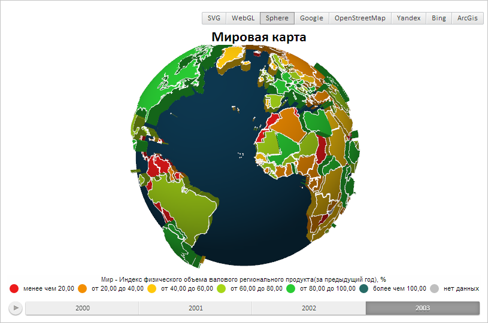

# Projection.rotate

Projection.rotate
-

# Projection.rotate

## Синтаксис

rotate(alpha: Number, v_x: PP.Vector3 || Number,
 y: Number, z: Number);

## Параметры

alpha. Угол поворота в градусах;

v_x. Вектор сдвига или его
 X-составляющая;

y. Y-составляющая вектора;

z. Z-составляющая вектора.

## Описание

Метод rotate поворачивает систему
 координат.

## Пример

Для выполнения примера предполагается наличие на странице компонента
 [MapChart](dhtmlMapChart.chm::/Components/MapChart/MapChart.htm)
 c наименованием «map» (см. «[Пример
 создания компонента MapChart](dhtmlMapChart.chm::/Components/MapChart/MapChart_Example.htm)»). Необходимо открыть
 сферическую карту. Поворачиваем систему координат сферической карты:

// Получаем объект класса для работы с трехмерной проекцией
var projection = map.getGLControl().getProjection();
// Поворачиваем систему координат
projection.rotate(30, 5);
В результате карта будет повернута:

См. также:

[Projection](Projection.htm)

		Справочная
		 система на версию 10.9
		 от 18/08/2025,
		 © ООО «ФОРСАЙТ»,
