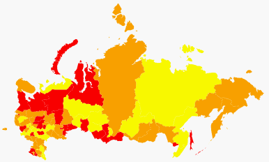

# ScaleBase.addItem

ScaleBase.addItem
-

# ScaleBase.addItem

## Синтаксис

addItem (value)

## Параметры

value. Значение элемента.

## Описание

Метод addItem добавляет элемент
 в шкалу.

## Пример

Для выполнения примера необходимо наличие на html-странице компонента
 [MapChart](dhtmlMapChart.chm::/Components/MapChart/MapChart.htm)
 (см. «[Размещение
 карты на HTML странице](dhtmlMapChart.chm::/Components/MapChart/HTML_layout.htm)») с наименованием «map», [xml-файла](dhtmlMapChart.chm::/Components/MapChart/xml_specification/xml-specification.htm)
 с настройками карты и топоосновы Russia.svg.

Xml-файл должен содержать настройку показателя заливки, который расположен
 первым в списке показателей карты. Фон заливки - объект зависимости, для
 которого настроена шкала.

Создадим функцию scaleSet() для изменения цветов шкалы:

function
 scaleSet() {

                scale
 = map.getFirstVisual().getBackground().getMapScale();

                scale.clearItems();//удаляем [элементы](ScaleBase.Items.htm)
 шкалы

                scale.addItem("Green");

                scale.addItem("Yellow");

                scale.addItem("Orange");

                scale.addItem("Red");

                map.draw();

            }

            map.Loaded.add(scaleSet);

После выполнения примера будет изменены цвета заливки карты:

См. также:

[ScaleBase](ScaleBase.htm)

		Справочная
		 система на версию 10.9
		 от 18/08/2025,
		 © ООО «ФОРСАЙТ»,
