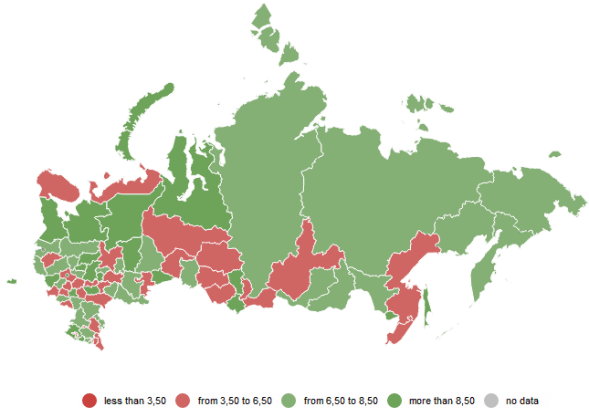
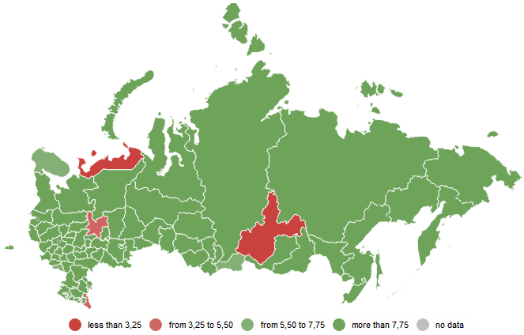

# ScaleBase.constructScaleElements

ScaleBase.constructScaleElements
-

# ScaleBase.constructScaleElements

## Синтаксис

constructScaleElements (values: Array)

## Параметры

values. Массив значений, по
 которым нужно построить шкалу.

## Описание

Метод constructScaleElements
 конструирует коллекцию интервалов шкалы на основе переданных данных

## Пример

Для выполнения примера необходимо наличие на html-странице компонента
 [MapChart](dhtmlMapChart.chm::/Components/MapChart/MapChart.htm)
 (см. «[Размещение
 карты на HTML странице](dhtmlMapChart.chm::/Components/MapChart/HTML_layout.htm)») с наименованием «map», [xml-файла](dhtmlMapChart.chm::/Components/MapChart/xml_specification/xml-specification.htm)
 с настройками карты и топоосновы Russia.svg.

Xml-файл должен содержать настройку показателя заливки, который расположен
 первым в списке показателей карты. Фон заливки - объект зависимости, для
 которого настроена шкала, содержащая значения типа [Brush](dhtmlCommon.chm::/Classes/PP/Brush/Brush.htm).
 Также в xml-файле должна быть [настроена
 легенда](dhtmlMapChart.chm::/Components/MapChart/xml_specification/MapChart/MapLegends/Legend_exmpl.htm) с идентификатором «MapLegend0».

Создадим массив с данными и рассчитаем интервалы шкалы на его основе.

Разбиение на интервалы в режиме «Равные интервалы» (Весь диапазон данных
 разбивается на заданное количество групп, содержащих одинаковое число
 единиц, которые при этом получаются разными по длине):

data = [1, 2, 3, 4, 5, 6, 7, 8, 9, 10]; //создаем массив данных

// количество элементов

var
 count = data.length;

// минимальное значение

var
 min = scale.setMinValue(data[0]);

// максимальное значение

var
 max = scale.setMaxValue(data[count - 1]);

scale = map.getFirstVisual().getBackground().getMapScale();

scale.setMode("Uniform");//разбиение на интервалы в режиме «Равные
 интервалы»

scale.setRecalcValues(true);
 //пересчитываем коллекцию значений шкалы

scale.constructScaleElements(data); //строим шкалу по новым данным

legend = map.getLegends().MapLegend0;

legend.draw(); //отрисуем
 легенду

Разбиение на интервалы в режиме «Линейно» (Весь диапазон данных разбивается
 на заданное количество равных по длине групп.):

data = [1, 2, 3, 4, 5, 6, 7, 8, 9, 10]; //создаем массив данных

//
 количество элементов

var
 count = data.length;

// минимальное значение

var
 min = scale.setMinValue(data[0]);

// максимальное значение

var
 max = scale.setMaxValue(data[count - 1]);

scale = map.getFirstVisual().getBackground().getMapScale();

scale.setMode("Linear");//разбиение на интервалы в режиме «Линейно»

scale.setRecalcValues(true);
 //пересчитываем коллекцию значений шкалы

scale.constructScaleElements(data); //строим шкалу по новым данным

legend = map.getLegends().MapLegend0;

legend.draw(); //отрисуем
 легенду

После выполнения примера интервалы шкалы будут
 рассчитаны на основе данных из созданного массива, будут установлены минимальное
 и максимальное значения шкалы и перерисутются легенда и карта:

Равные интервалы:

Линейно:

См. также:

[ScaleBase](ScaleBase.htm)

		Справочная
		 система на версию 10.9
		 от 18/08/2025,
		 © ООО «ФОРСАЙТ»,
