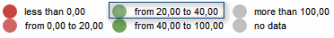

# ScaleBase.getValuesPair

ScaleBase.getValuesPair
-

# ScaleBase.getValuesPair

## Синтаксис

getValuesPair (index: Number);

## Параметры

index. Индекс
 интервала.

## Описание

Метод getValuesPair возвращает
 границы интервала по его индексу.

## Пример

Для выполнения примера необходимо наличие на html-странице компонента
 [MapChart](dhtmlMapChart.chm::/Components/MapChart/MapChart.htm)
 (см. «[Размещение
 карты на HTML странице](dhtmlMapChart.chm::/Components/MapChart/HTML_layout.htm)») с наименованием «map», [xml-файла](dhtmlMapChart.chm::/Components/MapChart/xml_specification/xml-specification.htm)
 с настройками карты и топоосновы Russia.svg.

Xml-файл должен содержать настройку показателя заливки, который расположен
 первым в списке показателей карты. Фон заливки - объект зависимости, для
 которого настроена шкала, содержащая значения типа [Brush](dhtmlCommon.chm::/Classes/PP/Brush/Brush.htm).
 Также в xml-файле должна быть [настроена
 легенда](dhtmlMapChart.chm::/Components/MapChart/xml_specification/MapChart/MapLegends/Legend_exmpl.htm) с идентификатором «MapLegend0».

При загрузке карты установим новые границы для третьего интервала шкалы
 и выведем их на экран:

        function scaleSet()
 {

            scale
 = map.getFirstVisual().getBackground().getMapScale();

            legend
 = map.getLegends().MapLegend0;

            legend.show();

            scale.setValue(1,
 20);//Устанавливаем первую границу третьего
 интервала

            scale.setValue(2,
 40);//Устанавливаем вторую границу третьего
 интервала

            values
 = scale.getValuesPair(2);//Получим границы
 интервала

            legend.draw();//обновим легенду

            alert("Новые
 границы интервала: " + values);

        }

        map.Loaded.add(scaleSet);

После выполнения примера для третьего интервала шкалы будут установлены
 новые границы - 20 и 40:

На экран будет выведено сообщение с новыми границами третьего интервала.

См. также:

[ScaleBase](ScaleBase.htm)

		Справочная
		 система на версию 10.9
		 от 18/08/2025,
		 © ООО «ФОРСАЙТ»,
