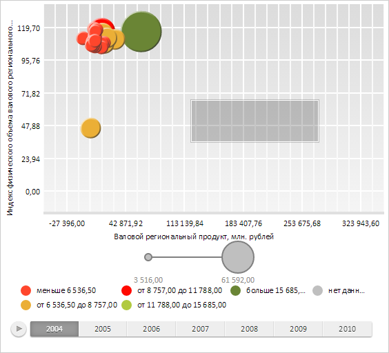

# AreaSelection.Aspect

AreaSelection.Aspect
-

# AreaSelection.Aspect

## Синтаксис

Aspect: Number;

## Описание

Свойство Aspect устанавливает
 отношение ширины рамки выделения к ее высоте.

По умолчанию значение свойства равно 0.

## Комментарии

Значение свойства устанавливается с помощью метода setAspect,
 а возвращается с помощью метода getAspect.

Если значение свойства равно 0, то ширина и высота рамки выделения являются
 независимыми.

## Пример

Для выполнения примера необходимо наличие на html-странице компонента
 [BubbleChart](dhtmlBubbleChart.chm::/Components/BubbleChart/BubbleChart.htm) с наименованием «bubbleChart»
 (см. «[Пример
 создания компонента BubbleChart](dhtmlBubbleChart.chm::/Components/BubbleChart/BubbleChart_Example.htm)»). Установим отношение ширины рамки
 выделения к ее высоте:

// Получаем рамку выделения пузырьковой диаграммы
var selection = bubbleChart.getAreaSelection();
//Устанавливаем отношение ширины рамки выделения к ее высоте
selection.setAspect(3);
Переместим курсор мыши в центр области отрисовки пузырьковой диаграммы и зажмем левую
 кнопку мыши. Удерживая кнопку, начнем перемещать курсор в сторону правого
 нижнего угла области отрисовки пузырьковой диаграммы. В результате на экране будет отображена
 рамка выделения пузырьковой диаграммы, ширина которой в три раза больше высоты:

См. также:

[AreaSelection](AreaSelection.htm)

		Справочная
		 система на версию 10.9
		 от 18/08/2025,
		 © ООО «ФОРСАЙТ»,
