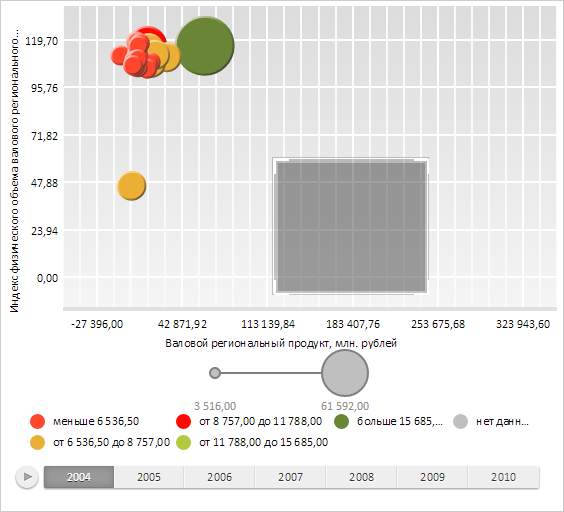

# AreaSelection.MinSize

AreaSelection.MinSize
-

# AreaSelection.MinSize

## Синтаксис

MinSize: Number;

## Описание

Свойство MinSize определяет
 минимальное значение ширины или высоты рамки, при котором выделение отображается.

## Комментарии

Значение свойства устанавливается с помощью метода setMinSize,
 а возвращается с помощью метода getMinSize.

По умолчанию значение свойства равно 3.

## Пример

Для выполнения примера необходимо наличие на html-странице компонента
 [BubbleChart](dhtmlBubbleChart.chm::/Components/BubbleChart/BubbleChart.htm) с наименованием «bubbleChart»
 (см. «[Пример
 создания компонента BubbleChart](dhtmlBubbleChart.chm::/Components/BubbleChart/BubbleChart_Example.htm)»). Установим минимальное значение
 размеров, а также тип рамки выделения:

// Получаем рамку выделения пузырьковой диаграммы
var selection = bubbleChart.getAreaSelection();
// Устанавливаем минимальное значение ширины или высоты рамки, при котором выделение отображается
selection.setMinSize(60);
// Устанавливаем форму рамки выделения
selection.setType(PP.Ui.AreaSelectionType.Cornered);
// Устанавливаем размер уголков рамки выделения в режиме PP.Ui.AreaSelectionType.Cornered
selection.setCornerSize(15);
Переместим курсор мыши в центр области отрисовки пузырьковой диаграммы и зажмем левую
 кнопку мыши. Удерживая кнопку, начнем перемещать курсор в сторону правого
 нижнего угла области отрисовки пузырьковой диаграммы. После того, как высота и ширина
 области выделения превысят 60 пикселей, на экране будет отображена рамка
 выделения в виде прямоугольника с уголками размером 15 пикселей:

См. также:

[AreaSelection](AreaSelection.htm)

		Справочная
		 система на версию 10.9
		 от 18/08/2025,
		 © ООО «ФОРСАЙТ»,
