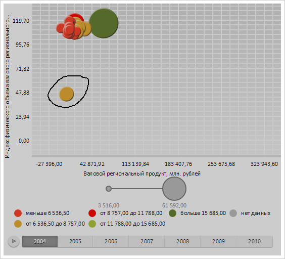
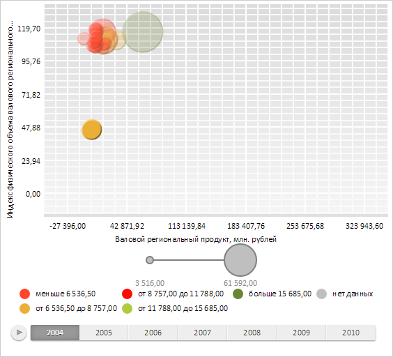

# AreaSelection.Path

AreaSelection.Path
-

# AreaSelection.Path

## Синтаксис

Path: PP.Path;

## Описание

Свойство Path определяет форму
 рамки выделения в режиме [PP.Ui.AreaSelectionType.FreeForm](../../../Enums/AreaSelectionType.htm).

## Комментарии

Значение свойства устанавливается с помощью метода setPath,
 а возвращается с помощью метода getPath.

## Пример

Для выполнения примера необходимо наличие на html-странице компонента
 [BubbleChart](dhtmlBubbleChart.chm::/Components/BubbleChart/BubbleChart.htm) с наименованием «bubbleChart»
 (см. «[Пример
 создания компонента BubbleChart](dhtmlBubbleChart.chm::/Components/BubbleChart/BubbleChart_Example.htm)»). Добавим обработчики событий движения
 и нажатия кнопки мыши. Добавим функцию, которая будет отрисовывать рамку
 во время выделения пузырьков пузырьковой диаграммы:

// Получаем рамку выделения пузырьковой диаграммы
var selection = bubbleChart.getAreaSelection();
// Выбираем свободный тип выделения
selection.setType("FreeForm");
// Получаем канву, на которой будет отрисовываться рамка
var canvas = bubbleChart.getChartArea().getHistoryLayer();
// Устанавливаем обработчик нажатия мыши
document.onmousedown = function() {
        check = true;
    }
    // Устанавливаем обработчик движения мыши
document.onmousemove = function(sender, args) {
        if (check) {
            // Получаем объект с координатами движения рамки
            var path = selection.getPath();
            // Отрисовываем рамку
            for (i in path.getPrimitives()) {
                var pr = path.getPrimitives()[i];
                canvas.drawLine(pr.x1 - canvas.getLeft(), pr.y1, pr.x2 - canvas.getLeft(), pr.y2);
            }
            canvas.flush();
        }
    }
    // Устанавливаем обработчик отпускания мыши
document.onmouseup = function() {
    bubbleChart.refresh();
    check = false;
}
Во время выделения пузырьков пузырьковой диаграммы будет отрисовываться рамка:

После окончания выделения, пузырьки были отмечены:

См. также:

[AreaSelection](AreaSelection.htm)

		Справочная
		 система на версию 10.9
		 от 18/08/2025,
		 © ООО «ФОРСАЙТ»,
