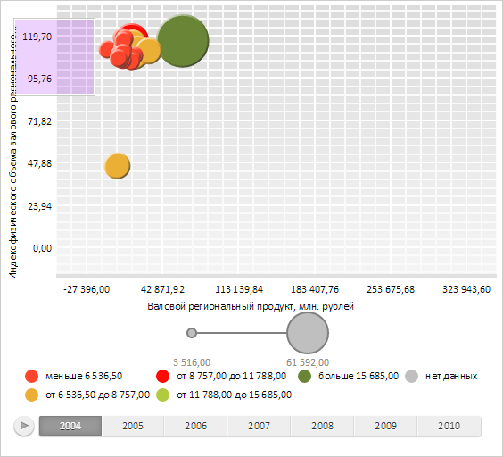
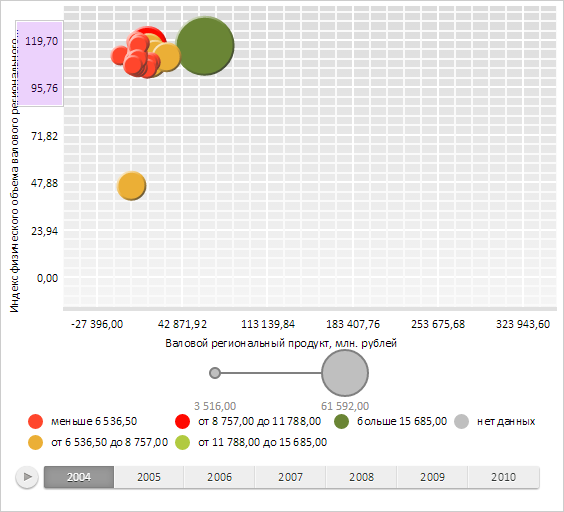

# AreaSelection.start

AreaSelection.start
-

# AreaSelection.start

## Синтаксис

start(x: Number, y: Number, bounds: [PP.Rect](dhtmlCommon.chm::/Classes/PP/Rect/Rect.htm));

## Параметры

x. Координата
 по оси X, с которой начнется выделение;

y. Координата
 по оси Y, с которой начнется выделение;

bounds. Прямоугольник,
 за пределы которого не должна выходить рамка выделения.

## Описание

Метод start начинает отрисовку
 рамки выделения.

## Комментарии

Завершение отрисовки рамки выделения производится с помощью метода [AreaSelection.end](AreaSelection.end.htm).

## Пример

Для выполнения примера необходимо наличие на html-странице компонента
 [BubbleChart](dhtmlBubbleChart.chm::/Components/BubbleChart/BubbleChart.htm) с наименованием «bubbleChart»
 (см. «[Пример
 создания компонента BubbleChart](dhtmlBubbleChart.chm::/Components/BubbleChart/BubbleChart_Example.htm)»). Создадим новую рамку выделения
 с другим фоновым цветом и добавим ее к пузырьковой диаграмме. Установим обработчик [события перемещения курсора мыши](AreaSelection.MouseMove.htm)
 для рамки выделения пузырьковой диаграммы и начнем отрисовку рамки выделения:

// Создаем рамку выделения
style = {
    'Release': {
        'Border': {
            'Width': 1,
            'Style': 'solid',
            'Color': '#FFFFFF'
        },
        'Background': {
            'Color': '#A020F0',
            'Opacity': 0.2
        },
        'Shadow': {
            Enabled: true,
            EnableOpacity: true,
            Size: 1,
            Color: '#33000000'
        }
    }
};
var areaSelect = new PP.Ui.AreaSelection({
    Style: style,
    ParentNode: bubbleChart.getDomNode()
});
// Получаем рамку выделения пузырьковой диаграммы
var selection = bubbleChart.getAreaSelection();
// Добавляем рамку выделения к пузырьковой диаграмме
selection.setSettings(areaSelect.getSettings());
// Добавляем обработчик события MouseMove
selection.MouseMove.add(function() {
    console.log("Событие MouseMove");
});
// Начинаем отрисовку рамки выделения
var rect = new PP.Rect("0, 0, 100, 100");
selection.start(10, 15, rect);
Далее переместим курсор мыши в правый нижний угол пузырьковой диаграммы. В результате
 этого действия на позиции с координатой X, равной 10, и Y, равной 15,
 была отрисована рамка выделения пузырьковой диаграммы, длина и ширина которой равны
 100 пикселям:

Также в консоли браузера было выведено сообщение о событии перемещения курсора
 мыши:

Событие MouseMove

Переместим курсор мыши по горизонтали на уровень середины рамки выделения.
 В результате этого действия ширина рамки уменьшится, следуя за курсором:

Завершим отрисовку рамки выделения:

// Завершаем отрисовку рамки выделения
selection.end();
В результате этого действия отрисовка рамки была завершена, поэтому
 дальнейшие перемещения курсора не окажут влияния на ширину и высоту рамки.

См. также:

[AreaSelection](AreaSelection.htm)

		Справочная
		 система на версию 10.9
		 от 18/08/2025,
		 © ООО «ФОРСАЙТ»,
