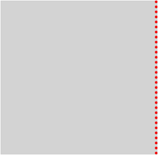

# Pen.applyToNode

Pen.applyToNode
-

# Pen.applyToNode

## Синтаксис

applyToNode(node: HTMLElement, side: String);

## Параметры

node. DOM-элемент, к которому
 применяется граница.

side.
 Расположение границы:

	- Left.
	 Слева;

	- Right.
	 Справа;

	- Top.
	 Сверху;

	- Bottom.
	 Снизу.

## Описание

Метод applyToNode устанавливает
 границу к указанному DOM-элементу.

## Пример

Для выполнения примера:

 1. Создайте html-страницу.

 2. Добавьте в теге
 <head> ссылки на js- и css-файлы:

	- PP.js;

	- PP.GraphicsBase.js;

	- PP.css.

 3. Добавьте в теге
 
После выполнения примера отобразится квадрат с пунктирной красной границей
 справа:

См. также:

[Pen](Pen.htm)

		Справочная
		 система на версию 10.9
		 от 18/08/2025,
		 © ООО «ФОРСАЙТ»,
