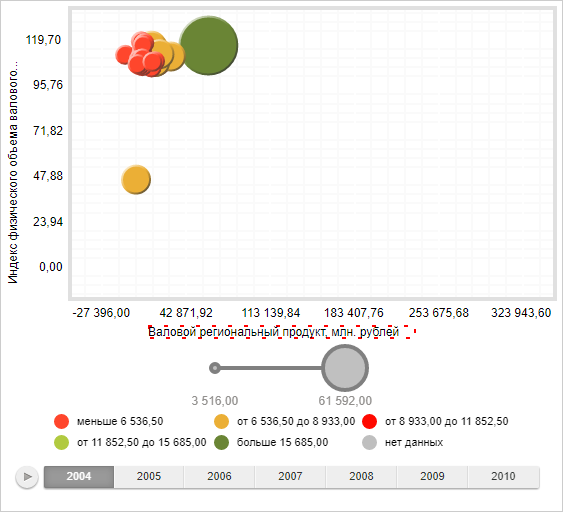

# Pen.toSVGFormat

Pen.toSVGFormat
-

# Pen.toSVGFormat

## Синтаксис

toSVGFormat(element: SVGElement);

## Параметры

element. SVG-элемент, для которого
 требуется применить настройки границы.

## Описание

Метод toSVGFormat устанавливает
 настройки границы для указанного SVG-элемента.

## Пример

Для выполнения примера необходимо наличие на html-странице компонента
 [BubbleChart](dhtmlBubbleChart.chm::/components/bubblechart/bubblechart.htm)
 с наименованием «bubbleChart» (см. «[Пример
 создания компонента BubbleChart](dhtmlBubbleChart.chm::/components/bubblechart/bubblechart_example.htm)»). В пузырьковом дереве
 зададим границы для заголовка оси X:

// Зададим границу
var pen = new PP.Pen({
            Color: "Red",
            Opacity: 0.5,
            Style: PP.PenStyle.Dotted,
            Width: 2,
        });
// Получим заголовок оси X
var label = bubbleChart.getChartArea().getAxisY().getCaption();
// Установим границу для SVG элемента
pen.toSVGFormat(label.getDomNode().firstChild);
После выполнения примера заголовок оси X будет выделен пунктиром красного
 цвета:

См. также:

[Pen](Pen.htm)

		Справочная
		 система на версию 10.9
		 от 18/08/2025,
		 © ООО «ФОРСАЙТ»,
