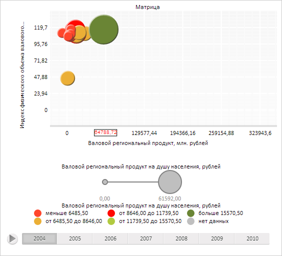

# PlacedControlBase.Background

PlacedControlBase.Background
-

**

# PlacedControlBase.Background

## Синтаксис

Background: [PP.Brush](dhtmlCommon.chm::/Classes/PP/Brush/Brush.htm);

## Описание

Свойство Background определяет
 кисть заливки фона визуального элемента управления.

## Комментарии

Значение свойства устанавливается из JSON и с помощью метода setBackground,
 а возвращается с помощью метода getBackground.**

## Пример

Для выполнения примера необходимо наличие на html-странице компонента
 [BubbleChart](dhtmlBubbleChart.chm::/Components/BubbleChart/BubbleChart.htm)
 с наименованием «bubbleChart» (см. «[Пример
 создания компонента BubbleChart](dhtmlBubbleChart.chm::/Components/BubbleChart/BubbleChart_Example.htm)»). Установим новое
 значение прозрачности фона области матрицы, установим левый отступ и нижнее
 поле области матрицы, установим заголовок области матрицы. Установим новый
 шрифт и границу текстовой метки оси X области матрицы, перерисуем текстовую
 метку, выведем общие значения ширины и высоты метки:

// Получим область пузырьковой диаграммы
var chartArea = bubbleChart.getChartArea();
// Получим фон области пузырьковой диаграммы
var background = chartArea.getBackground();
// Установим новое значение прозрачности фона
background.setOpacity(0.5);
// Установим фон области пузырьковой диаграммы
chartArea.setBackground(background);
// Установим левый отступ области пузырьковой диаграммы
chartArea.getMargin().setLeft(30);
// Установим нижнее поле области пузырьковой диаграммы
chartArea.getPadding().setBottom(30);
// Установим заголовок области пузырьковой диаграммы
var header = new PP.Ui.ChartLabel({
    Text: "Пузырьковая диаграмма",
    VerticalAlignment: PP.VerticalAlignment.Top,
    HorizontalAlignment: PP.HorizontalAlignment.Center
});
chartArea.setHeader(header);
// Получим текстовую метку оси X области пузырьковой диаграммы
var label = chartArea.getAxisX().getLabels().getItem(1);
// Определим стиль
var style = new PP.Style();
// Определим объект, определяющий черный цвет
var color = new PP.Color(255, 255, 255);
// Создадим новый объект границ
var borderSettings = {LeftColor: color, Width: 1}
var border = new PP.Border(borderSettings);
// Создадим новый объект шрифта
var fontSettings = { FontFamily: "Arial", Size: 10, Color: "red"}
var font = new PP.Font(fontSettings);
// Установим новые значения границ и шрифта для полученной метки и области пузырьковой диаграммы
label.setStyle(style, PP.ControlState.Release);
label.setFont(font);
label.setBorder(border);
chartArea.setStyle(style, PP.ControlState.Release);
chartArea.setFont(font);
// Обновим пузырьковую диаграмму
bubbleChart.refresh();
// Перерисуем текстовую метку
label.draw();
// Выведем общие значения ширины и высоты метки
console.log("Общая ширина метки: " + label.getRealWidth());
console.log("Общая высота метки: " + label.getRealHeight());
В результате выполнения примера была изменена прозрачность фона, левый
 отступ и нижнее поле области пузырьковой диаграммы, был установлен заголовок.
 Был установлен новый шрифт и границы для текстовой метки оси X области
 пузырьковой диаграммы, метка была перерисована:

Также в консоли браузера были выведены значения общей ширины и общей
 высоты полученной текстовой метки:

Общая ширина метки: 57

Общая высота метки: 25

См. также:

[PlacedControlBase](PlacedControlBase.htm)

		Справочная
		 система на версию 10.9
		 от 18/08/2025,
		 © ООО «ФОРСАЙТ»,
