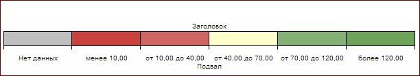

# Конструктор SpectrumLegend

Конструктор SpectrumLegend
-

# Конструктор SpectrumLegend

## Синтаксис

PP.Ui.SpectrumLegend(settings);

## Параметры

settings. JSON-объект со значениями
 свойств компонента.

## Описание

Конструктор SpectrumLegend создает
 экземпляр класса [SpectrumLegend](SpectrumLegend.htm).

## Пример

Для выполнения примера необходимо наличие на html-странице ссылок на
 файлы сценариев PP.js, PP.GraphicsBase.js и файл стилей PP.css. В теге
 <body> разместим блок с идентификатором «spectrum» для хранения
 созданной легенды:

Определим настройки спектральной легенды, разместив следующий код в
 блоке 
В результате выполнения примера на html-странице будет размещена [спектральная легенда](SpectrumLegend.htm):

См. также:

[SpectrumLegend](SpectrumLegend.htm)

		Справочная
		 система на версию 10.9
		 от 18/08/2025,
		 © ООО «ФОРСАЙТ»,
