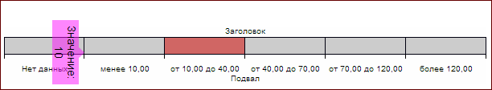

# SpectrumLegend.showToolTip

SpectrumLegend.showToolTip
-

# SpectrumLegend.showToolTip

## Синтаксис

showToolTip(value: Object);

## Параметры

value. Значение элемента подсказки.

## Описание

Свойство showToolTip отображает всплывающую подсказку.

## Пример

Для выполнения примера необходимо наличие на html-странице спектральной легенды с наименованием «spectrum» (см. «[Конструктор SpectrumLegend](Constructor_SpectrumLegend.htm)»). Получим всплывающую подсказку и перерисуем её. Отобразим подсказку со значением 10, установим для неё отступы и новое положение, повернем подсказку. Обработаем события [Selecting](SpectrumLegend.Selecting.htm) и [Selected](SpectrumLegend.Selected.htm):

// Получим всплывающую подсказку
var toolTip = spectrum.getToolTip();
// Перерисуем подсказку
toolTip.draw();
// Отобразим подсказку со значением 10
spectrum.showToolTip(10);
// Установим отступы
var thickness = new PP.Thickness({
    Bottom: 10
});
toolTip.setMargin(thickness);
// Установим новое положение подсказки
toolTip.setCoords(50, 50);
// Повернем подсказку
toolTip.setLTRB(PP.LTRB.Right, false);
var processSelectedEvent = true;
// Обработаем событие Selecting
spectrum.Selecting.add(function () {
    console.log("Инициировано событие Selecting")
});
// Обработаем событие Selected
spectrum.Selected.add(function () {
    if (processSelectedEvent) {
        console.log("Инициировано событие Selected")
        processSelectedEvent = false;
    }
});

В результате выполнения примера была отображена всплывающая подсказка с указанным значением, для неё были установлены отступы и новая позиция, подсказка была повернута:

Выделим элемент легенды, наведя на него курсор мыши. После этого в консоли браузера будут выведены сообщения о вызове обработанных событий:

Инициировано событие Selected

Инициировано событие Selecting

См. также:

[SpectrumLegend](SpectrumLegend.htm)

		Справочная
		 система на версию 10.9
		 от 18/08/2025,
		 © ООО «ФОРСАЙТ»,
