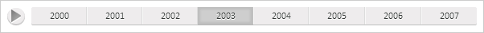

# Timeline.play

Timeline.play
-

**

# Timeline.play

## Синтаксис

play();

## Описание

Метод play** запускает
 воспроизведение анимации временной шкалы.

## Пример

Для выполнения примера необходимо наличие на странице компонента [Timeline](../../Components/Timeline/Timeline.htm) с наименованиями
 «timeline» (см. «[Пример
 создания компонента Timeline](../../Components/Timeline/Timeline_Example.htm)»). Запустим воспроизведение анимации
 и остановим её через одну секунду, а также обработаем события [Started](Timeline.Started.htm),
 [Paused](Timeline.Paused.htm), [Finished](Timeline.Finished.htm)
 и [ValueChanged](Timeline.ValueChanged.htm):

// Обработаем событие Started
timeline.Started.add(function (sender, args) {
    console.log("Начато воспроизведение анимации.");
});
// Обработаем событие Paused
timeline.Paused.add(function (sender, args) {
    console.log("Приостановлено воспроизведение анимации.");
});
// Обработаем событие Finished
timeline.Finished.add(function (sender, args) {
    console.log("Завершено воспроизведение анимации.");
});
// Обработаем событие ValueChanged
timeline.ValueChanged.add(function (sender, args) {
    console.log("Текущий шаг анимации: " + args.TickIndex);
});
// Запустим воспроизведение анимации
timeline.play();
if (timeline.getIsStarted()) {
    // Далее приостановим воспроизведение анимации через одну секунду
    setTimeout("timeline.pause();", 1000);
};

В результате выполнения примера воспроизведение анимации было запущено,
 а затем приостановлено через одну секунду:

В консоли браузера были выведены соответствующие уведомления и текущие
 шаги анимации:

Текущий шаг анимации: 2

Начато воспроизведение анимации.

Текущий шаг анимации: 3

Приостановлено воспроизведение анимации.

Далее продолжим воспроизведение анимации и завершим её через секунду:

// Продолжим воспроизведение анимации
timeline.resume();
// Остановим воспроизведением анимации через секунду
setTimeout("timeline.stop();", 1000);
После завершения воспроизведения анимации временная шкала примет исходное
 состояние , то есть индекс текущего шага анимации будет равен 0:

В консоли браузера были выведены уведомления о начале и завершении воспроизведения
 анимации и текущие шаги анимации:

Текущий шаг анимации: 4

Начато воспроизведение анимации.

Текущий шаг анимации: 5

Текущий шаг анимации: 0

Завершено воспроизведение анимации.

См. также:

[Timeline](Timeline.htm)

		Справочная
		 система на версию 10.9
		 от 18/08/2025,
		 © ООО «ФОРСАЙТ»,
