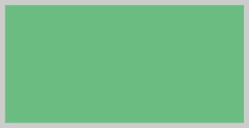

# Пример создания компонента Canvas

Пример создания компонента Canvas
-

# Пример создания компонента Canvas

Для выполнения примера необходимо наличие на html-странице ссылок на
 файл сценария PP.js и файл стилей PP.css. В тег <body> добавьте
 элемент 
 с идентификатором «canvas». В событии onload тега
 <body> необходимо указать вызов функции createCanvas(). Создадим
 канву и нарисуем прямоугольник:

function createCanvas() {
    // Создаем канву
    canvas = new PP.Ui.Canvas({
        // Устанавливает родительский элемент
        ParentNode: document.getElementById("canvas"),
        // Устанавливаем глобальную прозрачность
        GlobalOpacity: 1,
        // Устанавливаем ширину линий
        StrokeWidth: 15,
    });
    // Устанавливаем размеры канвы
    canvas.setBounds(14, 9, 411, 211);
    // Устанавливам стиль заливки фигур
    canvas.setFillStyle("#6BBC80");
    // Устанавливаем стиль границ фигур
    canvas.setStrokeStyle("#ССССС");
    // Рисуем прямоугольник
    canvas.drawRect(0, 0, 411, 211, true, false);
    // Применяем изменения канвы
    canvas.flush();
}
В результате будет создана канва с залитым прямоугольником:

См. также:

[Canvas](Canvas.htm)

		Справочная
		 система на версию 10.9
		 от 18/08/2025,
		 © ООО «ФОРСАЙТ»,
