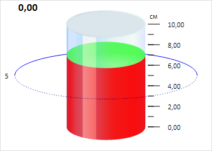

# Пример создания компонента Cylinder

Пример создания компонента Cylinder
-

# Пример создания компонента Cylinder

Для выполнения примера необходимо создать html-страницу и выполнить
 следующие действия:

1. Добавить ссылку на css-файл PP.css. Также нужно добавить ссылки на
 следующие js-файлы:

	- PP.js;

	- PP.Charts.js;

	- PP.GraphicsBase.js;

	- PP.Util.js;

	- resources.ru.js.

2. Далее в теге <head> необходимо добавить сценарий, создающий
 цилиндр:

3. В теге <body> в качестве значения атрибута «onLoad» указать
 имя функции для создания цилиндра:

<body onload="createCylinder()">
</body>
В результате выполнения примера на html-странице будет размещен компонент
 [Cylinder](Cylinder.htm):

Также в консоли браузера будет выведено сообщение о загрузке компонента:

Цилиндр загружен

См. также:

[Cylinder](Cylinder.htm)

		Справочная
		 система на версию 10.9
		 от 18/08/2025,
		 © ООО «ФОРСАЙТ»,
