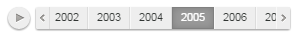

# Пример создания компонента Timeline

Пример создания компонента Timeline
-

# Пример создания компонента Timeline

Для выполнения примера необходимо создать html-страницу и выполнить
 следующие действия:

1. Добавить ссылку на файл стилей PP.css и файлы сценариев PP.js, jquery.js,
 PP.GraphicsBase.js, PP.Charts.js.

2. Далее в теге <head> необходимо добавить сценарий, создающий
 временную шкалу:

Для выполнения пользовательских сценариев над временной шкалой, в том
 числе примеров, приведённых на страницах описания свойств, методов и событий
 данного компонента, требуется разместить код либо после указанного
 выше сценария, либо в консоли браузера.

3. В теге <body> разместить блок с идентификатором «timeline»
 для хранения созданной временной шкалы:

В результате выполнения примера на html-странице будет размещён компонента
 [PP.Ui.Timeline](Timeline.htm):

При превышении ширины компонента, будут добавлены стрелки навигации:

См. также:

[Timeline](Timeline.htm)

		Справочная
		 система на версию 10.9
		 от 18/08/2025,
		 © ООО «ФОРСАЙТ»,
