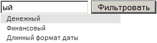

# ListBox.filterByText

ListBox.filterByText
-

# ListBox.filterByText

## Синтаксис

filterByText (value: String);

## Параметры

value. Строка, по которой осуществляется фильтрация.

## Описание

Метод filterByText осуществляет фильтрацию элементов списка по строке.

## Пример

Для выполнения примера подключите ссылки на библиотеку PP.js и таблицы визуальных стилей PP.css. Создадим список с наименование «LB». Для осуществления фильтрации по строке создадим поле для ввода текста с идентификатором «Text1» и кнопку для вызова метода filterByText с идентификатором «Button2»:

<input type="text" id="Text1" />

<input type="button" id="Button2" value="Фильтровать" onclick="Filter();" />

После выполнения примера на html-странице будет размещен список строк, поле для ввода текста и кнопка для осуществления фильтрации. Введите в поле ввода текст, нажмите на кнопку «Фильтровать». В списке будут выведены элементы, содержащие введенный текст:

См. также:

[ListBox](ListBox.htm)

		Справочная
		 система на версию 10.9
		 от 18/08/2025,
		 © ООО «ФОРСАЙТ»,
