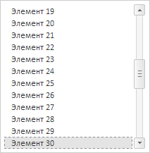
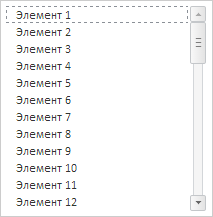
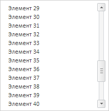

# ListBox.getScrollBox

ListBox.getScrollBox
-

# ListBox.getScrollBox

## Синтаксис

getScrollBox();

## Описание

Метод getScrollBox возвращает
 область прокрутки списка элементов.

## Пример

Для выполнения примера необходимо наличие на html-странице ссылок на
 файл сценария PP.js и файл стилей PP.css, в теге <body> html-страницы
 элемента 
 с идентификатором «listBox». В событии onload тега
 <body> необходимо указать вызов функции createListBox(). Добавляем
 на страницу список элементов и реализуем обработчики следующих событий:
 [ItemClick](ListBox.ItemClick.htm), [ItemMouseDown](ListBox.ItemMouseDown.htm),
 [SelectableSelected](ListBox.SelectableSelected.htm), [ItemEdited](ListBox.ItemEdited.htm),
 [ItemEditing](ListBox.ItemEditing.htm):

function createListBox() {
    // Создаем список элементов
    listBox = new PP.Ui.ListBox({
        // Устанавливаем родительский элемент
        ParentNode: document.getElementById("listBox"),
        // Устанавливаем признак прокручивания списка до выделенного элемента
        IsScrollToSelected: true,
        // Устанавливаем признак возможности редактирования элементов
        EnableEdit: true,
        // Устанавливаем признак выделения элементов по щелчку мыши
        SelectOnMouseDown: true,
        /* Устанавливаем признак возможности выбора
        пустого множества элементов */
        EmptySelection: true,
        // Устанавливаем ширину списка
        Width: 200,
        Height: 210,
        // Обрабатываем событие нажатия на элемент списка
        ItemClick: function(sender, args) {
            console.log("Нажата левая кнопка мыши по элементу: " +
                args.Item.getContent());
        },
        // Обрабатываем событие щелчка мыши по элементу списка
        ItemMouseDown: function(sender, args) {
            console.log("Кнопка мыши нажата на элементе: " +
                args.Item.getContent());
        },
        // Обрабатываем событие щелчка мыши по элементу списка
        SelectableSelected: function(sender, args) {
            console.log("Выполнен щелчок по элементу списка");
        },
        // Обрабатываем событие окончания редактирования элемента списка
        ItemEdited: function(sender, args) {
            console.log("Содержимое элемента: \"" + args.PrevValue +
                "\" изменено на \"" + args.NewValue + "\"");
        },
        // Обрабатываем событие редактирования элемента списка
        ItemEditing: function(sender, args) {
            console.log("Изменяется элемент с идентификатором: " +
                args.Item.getId());
        }
    });
    // Заполняем список элементами
    listBox.beginUpdate();
    for (var i = 1; i <= 50; i++) {
        listBox.addItem({
            Content: "Item " + i,
            Id: "ListItem" + i
        });
    }
    listBox.endUpdate();
}
Выводим в консоль содержимое пятого элемента списка:

console.log("Содержимое пятого элемента списка: " + listBox.getLayoutItems()[4].getContent());
В результате в консоль браузера было выведено содержимое пятого
 элемента:

Содержимое пятого элемента списка: Элемент 5

Выводим в консоль значение ширины и высоты области прокрутки списка:

// Получаем размеры области прокрутки
var scrollBox = listBox.getScrollBox();
console.log("Ширина области прокрутки: " + scrollBox.getWidth());
console.log("Высота области прокрутки: " + scrollBox.getHeight());
В результате в консоль браузера было выведено значение ширины
 и высоты области прокрутки списка:

Ширина области прокрутки: 200

Высота области прокрутки: 850

Получаем идентификатор 30 элемента и выделяем его:

// Получаем идентификатор 30 элемента списка
var id = listBox.getItems()[29].getId();
// Выделяем элемент с указанным идентификатором
listBox.selectItemById(id);
// Устанавливаем признак прокручивания списка до выделенного элемента
listBox.setIsScrollToSelected(true);
Прокручиваем список до выделенного элемента:

// Прокручиваем список до выделенного элемента
listBox.scrollToSelected();
В результате в списке будет выделен 30 элемент:

Получаем содержимое выделенного элемента списка:

// Получаем содержимое выделенного элемента
console.log("Содержимое выделенного элемента: " + listBox.getActiveItem().getContent());
В результате в консоль браузера было выведено содержимое выделенного
 элемента:

Содержимое выделенного элемента: Элемент 30

Устанавливаем фокус на первый элемент списка:

// Устанавливаем фокус на первый элемент списка
listBox.setSelectedFocus(0);
В результате в списке фокус будет установлен на 1 элемент:

Прокручиваем список до 40 элемента:

// Получаем 40 элемент
var itemListBox = listBox.getItems()[39];
// Прокручиваем список до 40 элемента
listBox.scrollToItem(itemListBox);
В результате список будет прокручен до 40 элемента:

Нажимаем кнопку мыши на втором элементе списка. В результате в консоль
 будет выведено:

Кнопка мыши нажата на элементе: Элемент 2

После отпускания кнопки мыши в консоль будет выведено:

Выделен элемент списка

Нажата левая кнопка мыши по элементу: Элемент 2

Выводим содержимое последнего выбранного элемента

// Выводим содержимое последнего выбранного элемента
var content = listBox.getLastItemClick() === undefined ? "Пусто" : listBox.getLastItemClick().getContent();
console.log("Содержимое последнего выбранного элемента: " + content);
В результате в консоль будет выведено:

Содержимое последнего выбранного элемента: Элемент
 2

Два раза нажимаем левой кнопкой мыши по третьему элементу списка и изменяем
 его значение на «Новое значение». Во время изменения значения в консоль
 будет выведено:

Изменяется элемент с идентификатором: ListItem167

После завершения изменения в консоль будет выведено:

Содержимое элемента: "Элемент 3" изменено
 на "Новое значение"

Очищаем список:

// Очищаем список
listBox.clear();
В результате все элементы будут удалены.

См. также:

[ListBox](ListBox.htm)

		Справочная
		 система на версию 10.9
		 от 18/08/2025,
		 © ООО «ФОРСАЙТ»,
