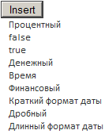

# ListBox.insertItem

ListBox.insertItem
-

# ListBox.insertItem

## Синтаксис

insertItem(value: Object, index: Number)

## Параметры

value. Элемент, который необходимо вставить в список. Это может быть текст, html-разметка, Dom-вершина или наследник PP.Ui.[Control](dhtmlUi.chm::/Classes/control/control.htm);

index. Индекс элемента.

## Описание

Метод insertItem добавляет элемент в позицию списка элементов, заданную параметром index.

## Пример

Для выполнения примера создайте компонент [ListBox](../../Components/ListBox/ListBox.htm), как показано в примере для метода [ListBox.filterByText](ListBox.filterByText.htm). Создадим html-кнопку, при нажатии на которую на выбранные позиции списка будут добавлены новые элементы:

<button onclick="Insert();">Insert</button>

В javascript-код добавьте функцию Insert(), при выполнении которой в список будут добавлены 3 элемента:

function Insert() {

        LB.insertItem(new PP.Ui.ListItem({ Content: "Дробный" }), 5);

        LB.insertItem(new PP.Ui.ListItem({ Content: "Время" }), 3);

        LB.insertItem(new PP.Ui.ListItem({ Content: "Процентный" }), 0);

        }

После выполнения примера при нажатии на кнопку «Insert» в список будут добавлены элементы на позиции, заданные в параметре index:

См. также:

[ListBox](ListBox.htm)

		Справочная
		 система на версию 10.9
		 от 18/08/2025,
		 © ООО «ФОРСАЙТ»,
