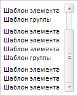
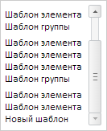

# LongListBox.isAllLoaded

LongListBox.isAllLoaded
-

# LongListBox.isAllLoaded

## Синтаксис

isAllLoaded();

## Описание

Метод isAllLoaded определяет,
 загружены ли все элементы списка.

## Комментарии

Метод возвращает значение true,
 если все элементы загружены, иначе - значение false.

## Пример

Для выполнения примера предполагается наличие на странице компонента
 [LongListBox](../../Components/LongListBox/LongListBox.htm)
 c наименованием «longListBox» (см. «[Пример
 создания компонента LongListBox](../../Components/LongListBox/Example_LongListBox.htm)»). Добавляем группу и проверяем, все
 ли элементы списка загружены:

// Добавляем еще одну группу
longListBox.beginUpdate();
longListBox.addGroups({ Items: [{}, {}, {}] });
longListBox.endUpdate();
// Проверяем, загружены ли все элементы списка
if (longListBox.isAllLoaded) {
    console.log("Все элементы загружены");
} else {
    console.log("Не все элементы загружены");
}
В результате в консоль будет выведен результат проверки:

Не все элементы загружены

Прокручиваем список до нижнего края и проверяем еще раз, все ли элементы
 загружены:

// Прокручиваем список до нижнего края
longListBox.getScrollBar().scrollTo(100, true);
В результате список будет прокручен до нижнего края:

В консоль будет выведен результат проверки:

Все элементы загружены

Проверяем, является ли последний видимый элемент последним среди всех
 элементов.

// Получаем последний видимый элемент
var arr = longListBox.getVisibleItems();
var lastVisibleItem = arr[arr.length - 1];
// Устанавливаем новый шаблон последнему элементу
lastVisibleItem.setTemplate("Новый шаблон");
// Проверяем, является ли последний видимый элемент, последним среди всех элементов
arr = longListBox.getItems(true);
var lastItem = arr[arr.length - 1];
if (lastVisibleItem.getId() == lastItem.getId()) {
    console.log("Последний видимый элемент является последним в списке");
} else {
    console.log("Последний видимый элемент не является последним в списке");
}
В результате в консоль будет выведен результат проверки последнего элемента:

Последний видимый элемент является последним в списке

Значение шаблона последнего элемента будет изменено на новое:

См. также:

[LongListBox](LongListBox.htm)

		Справочная
		 система на версию 10.9
		 от 18/08/2025,
		 © ООО «ФОРСАЙТ»,
