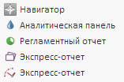

# Пример создания компонента ListBox

Пример создания компонента ListBox
-

# Пример создания компонента ListBox

Для выполнения примера предполагается наличие файла, содержащего набор
 пиктограмм, с наименованием «icons16x16.png» в папке build/img/app/.

В теге HEAD добавьте ссылки на файлы PP.js и PP.css.

В теге BODY добавьте элемент DIV с идентификатором «example».

В теге SCRIPT добавьте код для создания компонента [ListBox](ListBox.htm):

var listbox = new PP.Ui.ListBox({ //Создаем экземпляр компонента ListBox.
    ParentNode: document.getElementById("example"),
    ImageList: new PP.ImageList({
        //Источник спрайта
        Source: "../build/img/app/icons16x16.png",
        //Размер картинок в спрайте
        IconHeight: 16,
        IconWidth: 16
    }),
    //Ширина списка.
    Width: 200
});
//Добавляем элементы списка:
listbox.beginUpdate();
listbox.addItem("Навигатор");
listbox.addItem("Аналитическая панель");
listbox.addItem("Регламентный отчет");
listbox.addItem("Экспресс-отчет");
listbox.addItem("Рабочая книга");
listbox.endUpdate();
//Для всех элементов списка устанавливаем индекс столбца и строки картинки из спрайта:
for (var i = 0; i < listbox.getItems().length; i++) {
    listbox.getItems()[i].setColumnIndex(i);
    listbox.getItems()[i].setRowIndex(0);
};
После выполнения примера на html-странице будет создан компонент [ListBox](ListBox.htm), имеющий следующий вид:

См. также:

[ListBox](ListBox.htm)

		Справочная
		 система на версию 10.9
		 от 18/08/2025,
		 © ООО «ФОРСАЙТ»,
