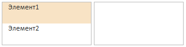
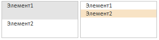

# Пример создания компонента ListBox с механизмом DragAndDrop

Пример создания компонента ListBox с механизмом DragAndDrop
-

# Пример создания компонента ListBox с механизмом Drag&Drop

Ниже приведен полный код html-страницы, на которой размещены два экземпляра
 компонента ListBox. Элементы первого списка перетаскиваются в область
 второго списка при помощи механизма Drag&Drop, реализованного посредством
 обработчиков событий [DragStart](dhtmlUi.chm::/Classes/Control/Control.DragStart.htm)
 и [DragEnd](dhtmlUi.chm::/Classes/Control/Control.DragEnd.htm).

<!DOCTYPE html PUBLIC "-//W3C//DTD XHTML
 1.0 Transitional//EN" "http://www.w3.org/TR/xhtml1/DTD/xhtml1-transitional.dtd">

<html xmlns="http://www.w3.org/1999/xhtml">

<head>

    <title>ListBox</title>

     <!--ссылка
 на библиотеку PP.js-->

    <link href="PP.css"
 rel="stylesheet" type="text/css" /> <!--ссылка
 на таблицы визуальных стилей PP.css-->

</head>

<body>

<!--Размещаем 2 компонента
 ListBox с идентификаторами «sample» и «sample2» в ячейках таблицы:-->

    <table>

        <tr>

            <td
 style="vertical-align: top;">

               

                

            </td>

            <td
 style="vertical-align: top;">

                

                

            </td>

        </tr>

     </table>

</body>

</html>

После выполнения примера на html-странице будут размещены два списка:

При помощи механизма Drag&Drop элементы первого списка перетаскиваются
 в область второго списка:

При перетаскивании компонентов в консоль выводятся сообщения о происходящих
 событиях.

См. также:

[DHTML-компоненты](dhtml.chm::/DHTML_components.htm)

		Справочная
		 система на версию 10.9
		 от 18/08/2025,
		 © ООО «ФОРСАЙТ»,
