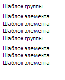

# Пример создания компонента LongListBox

Пример создания компонента LongListBox
-

# Пример создания компонента LongListBox

Для выполнения примера необходимо наличие на html-странице ссылок на
 файл сценария PP.js и файл стилей PP.css, в теге <body> html-документа
 элемента 
 с идентификатором «longListBox». В событии onload
 тега <body> необходимо указать вызов функции createLongListBox().
 Добавляем в документ сгруппированный список:

var longListBox;
function createLongListBox() {
    // Создаем сгруппированный список
    longListBox = new PP.Ui.LongListBox({
        // Устанавливаем родительский элемент
        ParentNode: document.getElementById("longListBox"),
        // Устанавливаем размеры
        Width: 120,
        Height: 150,
        // Устанавливаем высоту групповых элементов списка
        GroupsHeight: 20,
        // Устанавливаем высоту обычных элементов списка
        ItemsHeight: 15,
        // Устанавливаем шаблон для элементов списка
        ItemsTemplate: "Шаблон элемента",
        // Устанавливаем шаблон для групповых элементов списка
        GroupsTemplate: "Шаблон группы",
        // Устанавливаем несколько групп с элементами
        Groups: [{ Items: [{}, {}, {}] }, { Items: [{}, {}, {}] }]
    });
}
В результате получим сгруппированный список:

[LongListBox](LongListBox.htm)

		Справочная
		 система на версию 10.9
		 от 18/08/2025,
		 © ООО «ФОРСАЙТ»,
