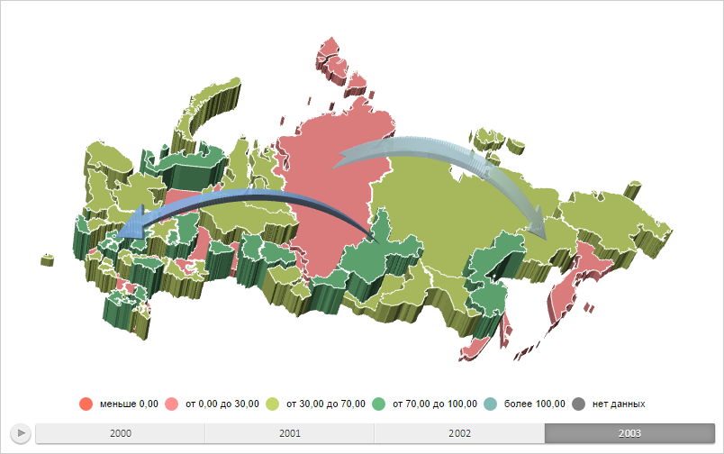

# Конструктор AreaVisual

Конструктор AreaVisual
-

# Конструктор AreaVisual

## Синтаксис

PP.AreaVisual(settings);

## Параметры

settings. JSON-объект со значениями
 свойств класса.

## Описание

Конструктор AreaVisual создает
 экземпляр класса AreaVisual.

## Пример

Для выполнения примера необходимо наличие на html-странице компонента
 [MapChart](../../../Components/MapChart/MapChart.htm) с наименованием
 «map» (см. «[Пример
 создания компонента MapChart](../../../Components/MapChart/MapChart_Example.htm)»). Также должна быть загружена карта
 типа «WebGL», для этого нужно выполнить следующую строку сценария:

changeMapType("WebGL");
Создадим и установим новый объект для работы с настройками сопоставления
 данных для территориального показателя:

// Возвращает слой с областями карты
function getWorkLayer() {
    return map.getLayer("Regions");
}
// Возвращает базовый класс территориального показателя карты
function getAreaVisual() {
    return getWorkLayer().getVisual();
}
// Выводит информацию о территориальном показателе
function printAreaVisualInfo(areaVisual) {
    console.log("Идентификатор источника для первого сопоставления данных: %s", areaVisual.getFirstDataSource().getId());
}
// Возвращает цвет
function getColorForValue(areaVisual, value) {
    // Получаем шкалу для сопоставления данных цветам заливки областей слоя карты
    var scale = areaVisual.getColorMapping().getScale();
    var minIndex, maxIndex;
    var minValue, maxValue;
    for (var i = 0; i < scale.getValues().length; i++) {
        if (scale.getValues()[i] <= value) {
            minValue = scale.getValues()[i];
            minIndex = i;
        } else {
            maxValue = scale.getValues()[i];
            maxIndex = i;
            break;
        }
        if (i == scale.getValues().length - 1) {
            maxValue = scale.getValues()[i];
            maxIndex = i;
        }
    }
    var color = scale.between(minIndex, maxIndex, value / (maxValue - minValue));
    return color;
}
// Возвращает источник данных
function getDataSource() {
    return map.getDataSources().DataSource0;
}
/* Создаёт объект для работы с настройками сопоставления данных
для территориального показателя */
function createAreaVisual() {
    var areaVisual = new PP.AreaVisual({
        ColorMapping: getColorMapping(),
        HeightMapping: getHeightMapping()
    });
    return areaVisual;
}
// Создаёт настройки сопоставления данных цвету заливки областей слоя карты
function getColorMapping() {
    var colorMappings = new PP.DataMapping({
        DataSource: getDataSource(),
        Type: PP.DataMappingType.Scale,
        DimAttributeId: "areaColor0",
        Id: "areaColor0",
        // Определяем шкалу
        Scale: new PP.ScaleBase({
            Items: "#FF705B #FF9191 #C3D66C #6BBC80 #82BAB6 Transparent",
            NoData: "Gray",
            TypeArguments: "Brush",
            Id: "MapScale0",
            Values: "0 30 70 100"
        })
    })
    return colorMappings;
}
// Создаёт настройки сопоставления данных высоте областей слоя карты
function getHeightMapping() {
    var colorMappings = new PP.DataMapping({
        DataSource: getDataSource(),
        Type: PP.DataMappingType.Scale,
        DimAttributeId: "areaHeight0",
        Id: "areaHeight0",
        // Определяем шкалу
        Scale: new PP.ScaleBase({
            Items: "11 23 57 69 85",
            NoData: "5",
            TypeArguments: "Double",
            Id: "scale0",
            Values: "15 40 60 75",
            ResultMode: PP.ScaleResultMode.IntervalsWithEquality
        })
    })
    return colorMappings;
}
// Обновляем легенду
function updateLegend(visualId) {
    var visual = map.getVisualById(visualId);
    var legend = map.getLegendByDataMapping(visual ? visual.getColorMapping() : null);
    legend.setScale(visual.getColorMapping().getScale());
    var freeArea = new PP.Rect({
        Left: 0,
        Top: 0,
        Width: 800,
        Height: 460
    });
    // Перерисовываем легенду
    legend.draw(freeArea, getWorkLayer().getDomNode());
}
/* Устанавливаем объект для работы с настройками сопоставления данных
для территориального показателя */
var areaVisual = createAreaVisual();
getWorkLayer().setVisual(areaVisual);
var visualId = "CustomAreaVisual";
map.addVisual(areaVisual, visualId);
// Перерисовываем карту
map.draw();
// Обновляем легенду
updateLegend(visualId);
// Выводим информацию о территориальном показателе
printAreaVisualInfo(areaVisual);
// Определяем цвет заливки области слоя карты со значением 15
var value = 15;
var brush = getColorForValue(areaVisual, value);
if (brush) {
    console.log("Цвет заливки для области слоя карты со значением %s: %s", 15, brush.getColor());
} else {
    console.log("Цвет для области слоя карты со значением %s не определён", value);
}
В результате выполнения примера были установлены новые настройки сопоставления
 данных для территориального показателя. В связи с этим элементы легенды
 карты были окрашены в другие цвета, а также была изменена высота областей
 слоя карты:

В консоли браузера были выведены идентификатор источника для первого
 сопоставления данных территориального показателя и цвет заливки для области
 слоя карты со значением 15:

Идентификатор источника для первого сопоставления
 данных: DataSource0

Цвет заливки для области слоя карты со значением
 15: #FF8076

См. также:

[AreaVisual](AreaVisual.htm)

		Справочная
		 система на версию 10.9
		 от 18/08/2025,
		 © ООО «ФОРСАЙТ»,
