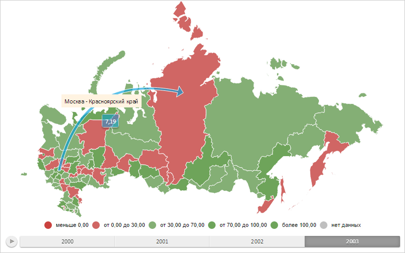

# MapArrowBase.IsRelativeWidth

MapArrowBase.IsRelativeWidth
-

# MapArrowBase.IsRelativeWidth

## Синтаксис

IsRelativeWidth: Boolean;

## Описание

Свойство IsRelativeWidth определяет,
 выражены ли размеры указателя стрелки в долях от её длины.

## Комментарии

Значение свойства устанавливается из JSON и с помощью метода setIsRelativeWidth,
 а возвращается с помощью метода getIsRelativeWidth.

Допустимые значения:

	- true.
	 Размеры указателя стрелки выражены в долях от её длины (по умолчанию);

	- false.
	 Размеры указателя стрелки выражены в пикселях.

## Пример

Для выполнения примера необходимо наличие на html-странице объекта типа
 [PP.MapArrowBase](MapArrowBase.htm) (см. «[Конструктор
 MapFilledArrow](../MapFilledArrow/MapFilledArrow.htm)») с наименованием «mapArrow». Установим для указателя
 стрелки значения в пикселях:

// Устанавливаем абсолютные значения шкалы
function setAbsoluteValuesForScale(mapArrow) {
    var scale = mapArrow.getVisual().getBasementWidthMapping().getScale();
    scale.setFirst(scale.getFirst() * 100);
    scale.setLast(scale.getLast() * 100);
    scale.setNoData(scale.getNoData() * 100);
}
// Устанавливает размеры указателя стрелки
function setArrowSize(mapArrow, size) {
    mapArrow.setPointerLength(size.Widht);
    mapArrow.setPointerWidth(size.Height);
}
// Устанавливаем размер указателя стрелки
setArrowSize(mapArrow, {
    Widht: 20,
    Height: 40
});
// Устанавливаем абсолютные значения для шкалы
setAbsoluteValuesForScale(mapArrow);
// Указываем, что размеры указателя стрелки выражены в пикселях
mapArrow.setIsRelativeWidth(false);
// Перерисовываем стрелку
mapArrow.draw();
В результате выполнения примера для указателя стрелки были установлены
 значения в пикселях:

См. также:

[MapArrowBase](MapArrowBase.htm)

		Справочная
		 система на версию 10.9
		 от 18/08/2025,
		 © ООО «ФОРСАЙТ»,
