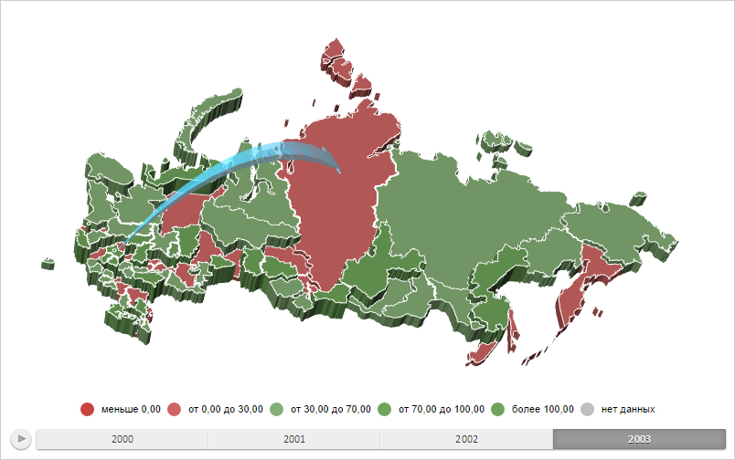

# MapArrowBase.Step3d

MapArrowBase.Step3d
-

# MapArrowBase.Step3d

## Синтаксис

Step3d: Double;

## Описание

Свойство Step3d определяет степень
 детализации стрелок на трёхмерной карте.

## Комментарии

Значение свойства устанавливается из JSON и с помощью метода setStep3d,
 а возвращается с помощью метода getStep3d.

Степень детализации стрелки - это коэффициент отношения размера одного
 сегмента стрелки к её длине. Если свойство равно 1, то используется один
 сегмент, если равно 0,5, то два сегмента и т. д.

## Пример

Для выполнения примера необходимо наличие на html-странице компонента
 [MapChart](../../../Components/MapChart/MapChart.htm) с наименованием
 «map» (см. «[Пример
 создания компонента MapChart](../../../Components/MapChart/MapChart_Example.htm)»). Также должна быть загружена карта
 типа «WebGL», для этого нужно выполнить следующую строку сценария:

changeMapType("WebGL");
Создадим трёхмерную стрелку, направленную от области слоя карты с идентификатором
 «RU-MOW» к области слоя карты с идентификатором «RU-KYA», со степенью
 детализации 0,095, а также обработаем событие перемещения указателя мыши:

// Возвращает слой с областями карты
function getWorkLayer() {
    return map.getLayer("Regions");
}
// Возвращает область слоя карты с указанным идентификатором
function getShape(shapeId) {
    var shape = getWorkLayer().getParentLayer().getShape(shapeId);
    map.setPieHoverness(shape);
    return shape;
}
// Возвращает настройки сопоставления данных стрелки
function getArrowVisual() {
    return map.getVisuals().MapArrowVisual;
}
// Создаёт пузырьковый показатель
function createMapArrow() {
    // Создаём стрелку с заливкой
    var mapArrow = new PP.MapFilledArrow({
        Chart: map,
        StartShape: "RU-MOS",
        EndShape: "RU-KYA",
        Visual: getArrowVisual(), // Сопоставление данных стрелки
        Id: "Filled", // Идентификатор стрелки
        Step3d: 0.095 // Степень детализации стрелки
    });
    return mapArrow;
}
// Отрисовывает стрелку на карте
function drawMapArrow(mapArrow) {
    // Устанавливаем стрелку
    var arrows = {};
    arrows[mapArrow.getId()] = mapArrow;
    mapArrow.getChart().setMapArrows(arrows);
    // Перерисовываем карту
    map.refresh();
    mapArrow.render3d();
}
// Выводит информацию о пересечении стрелки лучом
function printArrowIntersection(point) {
    var ray = map.getGLControl().getProjection().getRay(point);
    var intersection = mapArrow.getIntersectionWithRay(ray);
    if (intersection) {
        console.log("Расстояние от начала луча до точки его пересечения со стрелкой на карте (%s, %s): %s",
            point.X, point.Y, intersection);
    }
}
// Создаём стрелку с заливкой
var mapArrow = createMapArrow();
// Отрисовываем данную стрелку
drawMapArrow(mapArrow);
// Обрабатываем события перемещения мыши
function onMouseMove(sender, args) {
    var coords = null;
    coords = PP.calculateMouseCoords(args.Event);
    var containerPos = PP.calculateOffset(map.getDomNode());
    coords.X -= containerPos.X;
    coords.Y -= containerPos.Y;
    printArrowIntersection(coords);
};
// Добавляем созданный обработчик события
map.addEvent(map.getPaper(), "mousemove", onMouseMove);
В результате выполнения примера была отображена трёхмерная стрелка,
 направленная от области слоя карты с идентификатором «RU-MOW» к области
 слоя карты с идентификатором «RU-KYA», со степенью детализации 0,095:

При проведении указателя мыши над стрелкой в консоли браузера выводится
 расстояние от начала луча до точки его пересечения со стрелкой на карте:

Расстояние от начала луча до точки его пересечения
 со стрелкой на карте (306, 161): 0.6192349226321

См. также:

[MapArrowBase](MapArrowBase.htm)

		Справочная
		 система на версию 10.9
		 от 18/08/2025,
		 © ООО «ФОРСАЙТ»,
