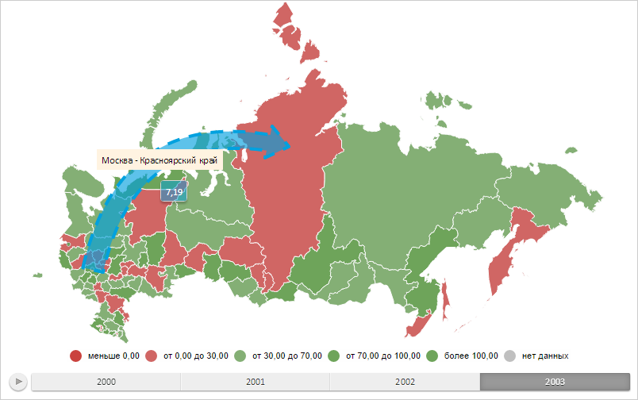

# MapArrowBase.setBorderSettings

MapArrowBase.setBorderSettings
-

# MapArrowBase.setBorderSettings

## Синтаксис

setBorderSettings(width: Double, color: String,
 style: [PP.BorderStyle](dhtmlCommon.chm::/Enums/BorderStyle.htm));

## Параметры

width. Толщина границы;

color. Цвет границы;

style. Стиль отрисовки границы.

## Описание

Метод setBorderSettings устанавливает
 настройки для границы стрелки на карте.

## Пример

Для выполнения примера необходимо наличие на html-странице объекта типа
 [PP.MapArrowBase](MapArrowBase.htm) (см. «[Конструктор
 MapFilledArrow](../MapFilledArrow/MapFilledArrow.htm)») с наименованием «mapArrow». Установим для стрелки
 на карте толщину, равную 2 пикселям, цвет, соответствующий цвету границы
 всплывающей подсказки, и штриховую линию:

function getBorderSettings(mapArrow, borderSettings) {
    // Создаём объект метаданных топоосновы карты
    var meta = new PP.MapTopobaseMeta();
    // Создаём атрибут для метаданных топоосновы карты
    var attribute = new PP.MapMetaAttribute({
        Name: "Border", // Наименование атрибута
        Type: "PP.Border" // Тип атрибута
    });
    // Определяем данные для созданного атрибута
    attribute.setAttributeData(new PP.MapMetaAttributeData({
        Id: mapArrow.getId(), // Идентификатор данных
        Value: borderSettings
    }));
    // Добавляем атрибут в метаданные
    meta.setAttribute(attribute);
    return meta;
}
// Применяет настройки стрелки на карте
function applyArrowSettings(mapArrow, meta) {
    if (meta) {
        var border = meta.getAttributeDataValue("Border", mapArrow.getId());
        // Применяем новые настройки для границы стрелки
        mapArrow.setBorderSettings(border.Width, border.Color, border.Style);
        // Обновляем карту
        map.refresh();
    }
}
// Выводим настройки стрелки на карте
function printArrowSettings(mapArrow, meta) {
    if (meta) {
        var value1 = meta.getAttributeDataValue("Border", mapArrow.getId());
        console.log("Толщина границы: %s", value1.Width);
        var value2 = meta.getAttributeData("Border", mapArrow.getId()).getValue();
        console.log("Цвет границы: %s", value2.Color);
        var value3 = meta.getAttribute("Border").getAttributeDataValue(mapArrow.getId());
        console.log("Стиль границы: %s", value3.Style);
    }
}
// Определяем настройки границы
var borderSettings = {
    Color: mapArrow.getToolTipColor(), // Цвет границы
    Width: 4, // Ширина границы
    Style: PP.BorderStyle.dashed // Стиль границы
};
// Получаем настройки границы стрелки
var meta = getBorderSettings(mapArrow, borderSettings);
// Применяем настройки стрелки
applyArrowSettings(mapArrow, meta);
// Выводим настройки стрелки на карте
printArrowSettings(mapArrow, meta);
В результате выполнения примера для границы стрелки были установлены
 толщина, равная 2 пикселям, цвет, соответствующий цвету границы всплывающей
 подсказки, и штриховая линия:

В консоли браузера были выведены новые настройки для границы стрелки
 на карте:

Толщина границы: 4

Цвет границы: #00A1DF

Стиль границы: dashed

См. также:

[MapArrowBase](MapArrowBase.htm)

		Справочная
		 система на версию 10.9
		 от 18/08/2025,
		 © ООО «ФОРСАЙТ»,
